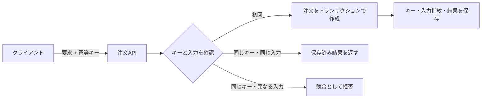

# API設計（API Design）

## 1. 一言でいうと

**API設計とは、利用者が何を要求でき、どの結果や失敗を期待できるかを、長期間安全に変更できる契約として定義することです。**

良いAPIはURLがきれいなだけではありません。名前、型、制約、認証、エラー、順序、再試行時の効果まで予測できます。一度公開すると複数のクライアントが異なる時期に更新されるため、内部コードより変更しにくい境界になります。

## 2. なぜ必要なのか

契約が曖昧だと、クライアントは実装の偶然に依存します。

- 同じ入力エラーがエンドポイントごとに400、409、422へ揺れる
- フィールド名や型の変更で旧アプリが動かなくなる
- タイムアウト後の再送で注文が二重作成される
- 一覧の取得中に商品が追加され、重複や読み飛ばしが起きる
- GraphQLの一つの要求が大量のDB問い合わせを発生させる

API設計では、正常系よりも変更と失敗を先に考えます。OpenAPIやProtocol Buffersのような機械可読な定義を使っても、業務上の意味と互換性の判断は設計者が担います。

## 3. 仕組み

### 4.1 APIスタイルを選ぶ

| スタイル | 主な考え方 | 向く場面 | 主な代償 |
|---|---|---|---|
| HTTPリソースAPI | URIで資源、メソッドで操作を表す | 公開API、Web・モバイル | 複数資源の画面では呼び出しが増えることがある |
| gRPC | 型付きサービスと手続きを `.proto` で定義 | 管理されたサービス間通信、ストリーミング | ブラウザや人手での確認に追加の仕組みが要る |
| GraphQL | 型付きスキーマからクライアントが必要な項目を指定 | 多様な画面を支える集約API | 実行コスト制御、認可、キャッシュが複雑 |

「RESTは公開、gRPCは内部」と固定せず、利用者、対応環境、ストリーミング、キャッシュ、スキーマ運用から決めます。

### 4.2 HTTPの意味を使う

- `GET /products/42`: 商品表現を取得する。安全かつ冪等な意味を持つ
- `PUT /users/7/profile`: 指定した表現で置き換える。意図した効果は冪等
- `POST /orders`: サーバーが新しい注文を作る。標準上は冪等とは限らない
- `DELETE /cart/items/9`: 対象を削除する。意図した効果は冪等

冪等とは、同じ要求を複数回行ったときの**意図したサーバー状態への効果**が一回と同じことです。毎回ログが増える、応答コードが変わる、といった付随動作まで同じである必要はありません。

### 4.3 ページネーション

| 方式 | 例 | 強み | 注意点 |
|---|---|---|---|
| オフセット | `?limit=20&offset=40` | 任意ページへ移動しやすい | 深い位置ほど走査コストが増え得る。更新中に結果がずれる |
| カーソル | `?limit=20&after=opaque-token` | 安定した順序で続きを取得しやすい | 任意ページへ直接移動しにくい。カーソル設計が必要 |

カーソル方式も「常にO(1)」ではありません。適切なインデックスと一意な並び順があれば、深いオフセットを避けやすい方式です。`created_at` が同じ行を扱うため、`(created_at, id)` のような一意になる組を使い、カーソル内部は不透明な値として扱います。

### 4.4 互換性

一般にフィールド削除、型変更、意味変更、必須入力の追加は破壊的です。任意フィールドの追加も、未知フィールドを拒否するクライアントや列挙値を網羅したコードには影響し得ます。「追加だから安全」と決めず、契約テスト、利用状況、廃止期間で確認します。

## 4. 具体例：注文作成API

前提は認証済み利用者のカートに商品があり、入力は配送先と支払方法、期待結果は一つだけ作られた注文です。

```http
POST /v1/orders HTTP/1.1
Content-Type: application/json
Idempotency-Key: 7ca9c58b-6b17-4c4b-9a25-58a6f920ab63

{"shippingAddressId":"addr_8","paymentMethodId":"pm_3"}
```



冪等キーを単なる短時間ロックにすると、処理完了後の再送で重複する可能性があります。キー、入力の指紋、処理状態、最終応答を永続化し、保持期間と同時要求時の応答を契約に含めます。

エラーはHTTPステータスに加えて、RFC 9457のProblem Detailsを利用できます。

```json
{
  "type": "https://api.example.com/problems/out-of-stock",
  "title": "在庫が不足しています",
  "status": 409,
  "detail": "商品 sku_42 の在庫が不足しています",
  "instance": "/orders/req_abc"
}
```

内部スタックトレースや秘密情報は返さず、クライアントが分岐に使う安定した問題種別と、人間が追跡できる識別子を返します。

## 5. いつ使うか・使わないか

- 多数の一般的なクライアントにはHTTPリソースAPIが扱いやすい
- 型とコード生成、低遅延のサービス間通信、双方向ストリームが重要ならgRPCを検討する
- クライアントごとに必要なデータ形状が大きく異なる集約層ではGraphQLを検討する
- 単純なCRUDでGraphQLの実行量制御を運用できないなら無理に導入しない
- 同一アプリ内部の変更しやすい関数境界まで、公開APIのように固定しない

一つのシステムで複数方式を使って構いません。ただし同じ業務操作の意味が方式ごとに食い違わないようにします。

## 6. 設計上の選択肢とトレードオフ

| 判断軸 | 選択肢 | 確認すること |
|---|---|---|
| バージョン | URI、ヘッダー、スキーマ進化 | 誰がいつ移行できるか |
| 更新 | PUT、PATCH、業務操作POST | 全置換か部分更新か、競合をどう検出するか |
| ページング | オフセット、カーソル | ランダム移動か、更新中の安定性か |
| エラー | 独自形式、Problem Details | 機械判定と人間の調査を両立できるか |
| 冪等性 | 操作自体を冪等化、冪等キー | 保持期間、同時実行、異なる入力をどう扱うか |

APIのバージョンは破壊的変更を自由にする免罪符ではありません。新旧を同時運用するコストがあるため、可能なら追加的変更と段階的廃止を優先します。

## 7. よくある失敗と運用上の注意

### DBの形をそのまま公開する

内部の列名や正規化構造が契約になり、DB変更がAPI破壊へ直結します。利用者の業務概念に合わせた表現を定義します。

### ステータスコードだけで詳細を表す

同じ409でも在庫競合と更新競合では対処が違います。安定した問題種別、対象フィールド、追跡IDを返します。

### 入力検証を形式だけで終える

文字列長や型に加え、「その利用者が住所を所有する」「注文状態が変更可能」といった業務制約と認可を検証します。

### API Gatewayだけで互換性を管理する

ルーティングはできても、フィールドの意味や業務制約は管理できません。スキーマ差分、契約テスト、利用メトリクス、廃止通知を運用します。

## 8. 第三者へ説明する

### 30秒で説明するなら

> API設計は、利用者が何を要求でき、どんな成功や失敗を期待できるかを安定した契約にすることです。HTTP、gRPC、GraphQLは利用者と通信要件から選び、互換性、入力検証、エラー、ページネーション、再試行時の冪等性まで定義します。内部実装を変えても契約を守れることが重要です。

### 3分で説明するなら

1. APIは複数クライアントと長期間共有する契約だと定義する。
2. HTTPリソースAPI、gRPC、GraphQLの利用者と代償を比較する。
3. 注文作成を例に入力、成功、Problem Details、認可を示す。
4. 応答喪失後の再送を冪等キーで一回の注文へ対応づける。
5. 追加変更も含め、契約テストと廃止手順で互換性を管理すると結ぶ。

## 9. ケース問題・追加質問

### ケース問題

モバイルアプリが注文作成後にタイムアウトし、同じPOSTを再送しました。二重注文を防ぐ設計を説明してください。

::: details 模範回答
クライアントが一つの業務試行に同じ冪等キーを付けます。サーバーはキーと入力指紋を注文作成と同じ信頼できる境界で保存し、再送には保存済み結果を返します。同じキーで入力が違えば拒否します。処理中の同時要求、保存期間切れ、失敗後の再試行も契約に定めます。キーだけをRedisへ短時間保存しDB書き込みと分離すると、障害時に不整合が起こる点にも注意します。
:::

### よくある追加質問

**Q. POSTは冪等にできませんか？**

HTTP標準ではPOST自体の意味は冪等と定義されていませんが、個別APIが冪等キーなどで再送を安全にできます。

**Q. GraphQLならエンドポイントのバージョンは不要ですか？**

スキーマを追加的に進化させやすい一方、フィールドの意味変更や削除には廃止手順が必要です。互換性の課題そのものは残ります。

**Q. 400と422はどう使い分けますか？**

組織内で一貫した規約を決めます。HTTPの一般的な意味を守りつつ、クライアントが問題種別で安定して分岐できることが重要です。

## 10. まとめ

- APIは内部実装ではなく、利用者と共有する長期的な契約である。
- スタイルは流行ではなく、利用者、型、通信、運用要件から選ぶ。
- 互換性は構文だけでなく、値の意味や列挙値の追加まで確認する。
- ページネーションは順序と更新中の振る舞いを定義する。
- 変更操作は結果不明と再送を前提に冪等性を設計する。

## 11. 参考資料

- [RFC 9110: HTTP Semantics](https://www.rfc-editor.org/rfc/rfc9110.html)
- [RFC 9457: Problem Details for HTTP APIs](https://www.rfc-editor.org/rfc/rfc9457.html)
- [gRPC: Introduction](https://grpc.io/docs/what-is-grpc/introduction/)
- [GraphQL Specification](https://spec.graphql.org/October2021/)
- [OpenAPI Specification](https://spec.openapis.org/oas/latest.html)
