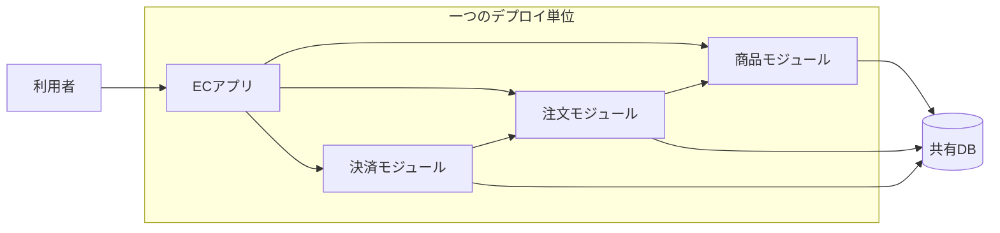

# アーキテクチャ（Architecture）

## 1. 一言でいうと

**ソフトウェアアーキテクチャとは、変更や障害の影響を望ましい範囲に閉じ込めるために、システムの責務・依存関係・実行単位をどう分けるかという重要な設計判断の集合です。**

建物の間取りに似ています。壁を増やせば影響を分離できますが、移動や配管は複雑になります。サービスを細かく分ける場合も同じで、独立性を得る代わりに通信、データ整合性、監視、デプロイの負担が増えます。

重要なのは図の形ではなく、次の問いに理由付きで答えられることです。

1. 何を一緒に変更・デプロイするのか
2. どの方向の依存を許すのか
3. データの所有者は誰か
4. どこで障害を止めるのか
5. 増えた複雑さを誰が運用するのか

## 2. なぜ必要なのか

小さなECサイトなら、商品、注文、決済を一つのアプリケーションに置いても問題ありません。しかし規模が大きくなると、次の変化が起きます。

- 注文機能の変更が商品検索まで壊す
- 一部の高負荷に合わせてアプリケーション全体を増強する
- 複数チームが同じコードとDBスキーマを同時に変更する
- 決済サービスの遅延がサイト全体へ波及する
- どの判断で現在の構成になったのか分からなくなる

アーキテクチャは、このような品質上の要求を満たすためにあります。品質には性能だけでなく、信頼性、セキュリティ、変更容易性、運用性、コストも含まれます。すべてを最大化する構成はないため、優先順位とトレードオフを明示します。

## 3. 仕組み

### 4.1 論理的な分割と物理的な分割

- **モジュール**: コード上の責務と依存関係の境界
- **プロセス**: 実行時の障害・メモリ・スケールの境界
- **サービス**: APIやメッセージで協調し、独立して変更・配置できる単位
- **データ所有境界**: 書き込み規則と整合性を管理する単位

コードをフォルダに分けただけでは実行時の障害は分離されません。逆に、別プロセスへ分けても同じDBテーブルを自由に更新すれば、データ変更を通じた強い結合が残ります。



この図はモジュラーモノリスの一例です。一つのプロセスでも、公開インターフェースと依存方向を守れば変更の影響を制御できます。

### 4.2 代表的なスタイル

| スタイル | 境界 | 強み | 主な代償 |
|---|---|---|---|
| レイヤードモノリス | UI・業務・データアクセス層 | 理解・開発・配置が容易 | 機能単位の独立性が弱くなりやすい |
| モジュラーモノリス | 業務能力ごとのコード境界 | 単純な運用と明確な責務を両立 | 境界を自動テストなどで守る必要がある |
| マイクロサービス | 業務能力ごとのプロセスとデータ | 独立デプロイ、個別スケール、障害分離 | 通信、整合性、監視、デプロイが複雑 |
| イベント駆動 | イベントの発行者と購読者 | 時間的な疎結合、処理の追加が容易 | 重複、順序、遅延、追跡への対処が必要 |

スタイルは排他的ではありません。モジュラーモノリスの一部でイベントを使う、マイクロサービス内部をレイヤー化する、といった組み合わせが一般的です。

### 4.3 依存方向を設計する

注文確定というユースケースを考えます。中心に置くべきなのは「注文を確定できる条件」であり、HTTPや特定DBの都合ではありません。

```text
HTTPハンドラー → 注文ユースケース → 注文ドメイン
                         ↓
                注文リポジトリIF
                         ↑
                 PostgreSQL実装
```

内側の業務ルールが外側の技術詳細を直接知らないようにすると、テストや置き換えが容易になります。ただし、単純なCRUDまで抽象化を重ねると、ファイル数と変換処理だけが増えることがあります。境界は「独立して変化する理由」がある場所に置きます。

## 4. 具体例：ECサイトを成長させる

### 5.1 最初はモジュラーモノリスにする

立ち上げ期は要件の変化が大きく、運用チームも小さいとします。この段階では、商品・注文・決済を一つのデプロイ単位に置きます。

```text
src/
  catalog/   # 商品の登録・検索を所有
  ordering/  # カートと注文を所有
  payment/   # 決済要求と結果を所有
```

各モジュールは、自分の公開APIを介してのみ呼び出します。注文モジュールが商品テーブルを直接更新する、といった越境を禁止します。この制約は依存関係テストやコードレビューで守ります。

### 5.2 必要になった境界だけを分離する

後に、決済だけ次の条件を持つようになったとします。

- PCI DSSの対象範囲を狭めたい
- 障害やデプロイを注文受付から分離したい
- 専任チームが独立した周期で変更したい

このとき初めて、決済モジュールをサービスとして分離する根拠が生まれます。注文側は決済のタイムアウトや失敗を前提にし、処理状態と冪等キーを保存します。分離前にはなかったネットワーク障害とデータ不整合への設計が必要です。

## 5. いつ使うか・使わないか

### モジュラーモノリスが向く場合

- チームが小さく、同じ周期でリリースできる
- トランザクション整合性が重要
- ドメイン境界がまだ学習途中
- 分散システムを運用する基盤が整っていない

### マイクロサービスを検討する場合

- 独立デプロイや個別スケールが継続的な価値を生む
- 業務境界とデータ所有者が十分に明確
- 複数チームの調整コストが単一配置の利点を上回る
- 監視、自動デプロイ、障害対応をサービスごとに担える

「将来スケールするかもしれない」だけでは、分散化の確かな根拠になりません。実測したボトルネックや組織上の制約から判断します。

## 6. 設計上の選択肢とトレードオフ

| 判断軸 | 一体化すると | 分離すると |
|---|---|---|
| 変更 | 横断変更が容易 | 独立変更しやすいが契約管理が必要 |
| データ | ACIDトランザクションを使いやすい | 結果整合性や補償処理が必要になりやすい |
| 性能 | プロセス内呼び出しで低遅延 | 通信遅延と障害が加わる |
| 障害 | 一つの不具合が全体へ広がりやすい | 隔離できるが連鎖障害対策が必要 |
| 運用 | 配置と監視が単純 | サービス数に応じて運用対象が増える |
| 組織 | 全体調整が必要 | チームの自律性を高められる |

選択時には、機能要件だけでなく、予想負荷、SLO、データ整合性、チーム構成、リリース頻度、法令・セキュリティ、運用能力を並べます。判断理由はArchitecture Decision Record（ADR）などへ残し、前提が変わったら見直します。

## 7. よくある失敗と運用上の注意

### 分散モノリス

サービスは分かれているのに、同期呼び出しの長い鎖、共有DB、一斉リリースが必要な状態です。分散システムの運用負担だけを負い、独立性を得られません。

### 境界より先に技術を選ぶ

Kubernetesやメッセージブローカーを採用しても、責務と所有権が曖昧なら問題は解決しません。まず変更理由とデータ所有者から境界を決めます。

### 正常系の図だけを作る

実運用では、タイムアウト、再試行、部分失敗、重複、バックプレッシャーが起きます。構成図にはデータの流れだけでなく、障害時の責任と観測方法も対応づけます。

### 一度決めた構成を固定する

アーキテクチャは仮説です。デプロイ所要時間、変更失敗率、障害復旧時間、サービス間通信量、チーム間調整時間などを観測し、狙った効果が出ているかを確かめます。

## 8. 第三者へ説明する

### 30秒で説明するなら

> ソフトウェアアーキテクチャは、システムの責務・依存関係・実行単位をどう分けるかという重要な設計判断です。目的は、変更や障害の影響を制御し、性能や信頼性などの要件を満たすことです。細かく分けるほど独立性は高まりますが、通信やデータ整合性、運用は複雑になるため、要件とチームの能力から選びます。

### 3分で説明するなら

1. アーキテクチャは「何をどこに置くか」だけでなく、変更・障害・データの境界を決めるものだと定義する。
2. ECサイトの商品・注文・決済を例に、最初は一つの配置でもモジュール境界を守れると説明する。
3. 決済だけに独立デプロイ、規制対応、障害分離が必要になれば、サービス分割の根拠になると示す。
4. 分割するとネットワーク障害、結果整合性、監視などの負担が増えると説明する。
5. 要件、SLO、データ所有、組織、運用能力を比較し、観測データで判断を見直すと結ぶ。

## 9. ケース問題・追加質問

### ケース問題

月間注文数がまだ少ないECサイトを、3人のチームが新規開発します。将来の成長を見込み、商品・注文・決済を最初から別サービスにすべきでしょうか。

::: details 模範回答
現時点ではモジュラーモノリスを第一候補にします。独立デプロイや個別スケールが必要だという実測上の根拠がなく、3人で複数サービスの監視、デプロイ、障害対応を担う負担が大きいためです。ただし、商品・注文・決済のコードとデータ操作の境界は明確にします。将来、変更頻度、負荷、セキュリティ要件、チーム所有権に差が生まれた境界から分離できるようにします。
:::

### よくある追加質問

**Q. モノリスは悪い設計ですか？**

いいえ。デプロイ単位が一つであることと、内部構造が無秩序であることは別です。明確なモジュール境界を持つモノリスは、小規模なチームや整合性重視のシステムに適します。

**Q. サービスは何行単位で分けますか？**

行数では決めません。独立して変化する業務能力、データ所有権、チームの責任、必要な品質特性から境界を探します。

**Q. 疎結合なら非同期通信を使えばよいですか？**

非同期通信は時間的な依存を弱めますが、重複処理、順序、結果整合性、追跡の難しさが増えます。呼び出し元が即時結果を必要とするかを基準に選びます。

## 10. まとめ

- アーキテクチャは、変更・障害・データの影響範囲を設計する判断の集合である。
- モノリスかマイクロサービスかは優劣ではなく、要件と制約への適合で決める。
- 論理的なモジュール境界と物理的なサービス境界を区別する。
- 分割は独立性を高める一方、通信、整合性、監視、デプロイを複雑にする。
- 小さく始め、観測した問題と明確な境界を根拠に進化させる。

## 11. 参考資料

- [Microsoft Azure Architecture Center: Architecture styles](https://learn.microsoft.com/en-us/azure/architecture/guide/architecture-styles/)
- [Microsoft Azure Architecture Center: Microservices architecture style](https://learn.microsoft.com/en-us/azure/architecture/guide/architecture-styles/microservices)
- [Microsoft Azure Architecture Center: Event-driven architecture style](https://learn.microsoft.com/en-us/azure/architecture/guide/architecture-styles/event-driven)
- [AWS Well-Architected Framework](https://docs.aws.amazon.com/wellarchitected/latest/framework/welcome.html)
