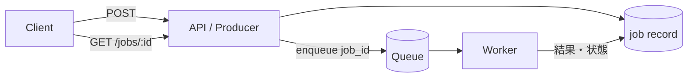

# バックグラウンド処理とジョブキュー（Background Processing & Job Queues）

## 1. 一言でいうと

**バックグラウンド処理とは、利用者が待つ必要のない仕事を耐久的なキューへ記録し、別のワーカーが後で実行する仕組みです。**

応答を速くし、一時的な負荷差や障害を吸収できます。しかし、受け付けたことと完了したことは別です。利用者へ状態を示し、重複実行、失敗、長時間停止を扱う必要があります。

## 2. なぜ必要なのか

ECサイトで請求書PDF生成に30秒かかると、HTTP接続を維持したままではタイムアウトしやすく、再送による二重処理も起こります。APIがジョブを保存してIDを返せば、ワーカーを独立に増減でき、障害時に再試行できます。

ただし数十ミリ秒で終わる単純更新までジョブにすると、結果整合性、状態API、キュー運用が増えます。利用者がその場で必要とする結果は同期処理の候補です。

## 3. 仕組み

### 4.1 構成と状態



ジョブ状態は最低でも`QUEUED`、`RUNNING`、`SUCCEEDED`、`FAILED`を区別します。遅延実行には`SCHEDULED`、回復不能な失敗には`DEAD`を加えることがあります。状態遷移と、誰がどの遷移を行えるかを明確にします。

### 4.2 受信確認と可視性タイムアウト

多くのキューでは、ワーカーが受信しても即削除せず、一時的に他ワーカーから見えなくします。時間内に成功確認・削除できなければ再び配信対象になります。処理時間より短いと同時重複が増え、長すぎるとクラッシュ後の回復が遅れます。長時間処理はハートビートで延長するか、小さなステップへ分割します。

## 4. 具体例：請求書PDFを生成する

```http
# 前提: order-42 は支払い済みで、利用者に参照権限がある
POST /orders/42/invoices
Idempotency-Key: invoice-order-42-v1

# 期待結果: 完了を意味せず、状態確認先を返す
HTTP/1.1 202 Accepted
Location: /jobs/job-801

{"jobId":"job-801","status":"QUEUED"}
```

```sql
-- 前提: idempotency_key に一意制約がある。
INSERT INTO jobs (idempotency_key, type, order_id, status)
VALUES ('invoice-order-42-v1', 'GENERATE_INVOICE', 42, 'QUEUED')
ON CONFLICT (idempotency_key) DO NOTHING;
-- 期待結果: APIが再送されても論理ジョブは一つだけ。
```

ワーカーも同じキーで結果を一意に保存します。PDFを先に外部ストレージへ置いてからDB保存に失敗する場合に備え、決定的なオブジェクトキーを使うか、孤立オブジェクトの清掃を行います。

## 5. いつ使うか・使わないか

### 向く場合

- メール、画像変換、レポートなど、利用者が完了を待たなくてよい
- 秒〜分単位で時間がかかり、HTTPタイムアウトを超え得る
- 負荷の山を平準化し、ワーカーだけを増減したい
- 失敗時に安全に再試行できる

### 向かない場合

- 利用者が次の操作に即時結果を必要とする
- 単一DBトランザクションで短く完結する
- 実行時点の古いデータでは業務上危険である
- 状態表示、再試行、滞留への運用体制がない

## 6. 設計上の選択肢とトレードオフ

| 判断軸 | 選択肢と代償 |
|---|---|
| ペイロード | IDだけなら小さく最新値を読める。スナップショットなら再現性は高いが古くなり得る |
| 優先度 | 別キュー・専用ワーカーは隔離しやすいが容量管理が増える |
| 再試行 | 一時障害に有効だが、副作用の重複と障害増幅に注意 |
| 定期実行 | 少なくとも1回起動を前提に、処理対象期間と重複排除を設計する |
| 結果保持 | 状態確認に必要だが、個人情報と保存コストが増える |

優先ジョブが常に流れると低優先度が永久に待つため、専用容量や公平性を決めます。ジョブの期限を過ぎたら実行しないという判断も必要です。

## 7. よくある失敗と運用上の注意

### 失敗をすべて同じように再試行する

タイムアウトや一時的な503は再試行候補ですが、入力不正や権限不足は通常直りません。分類し、指数バックオフとジッター、上限を設定します。DLQには担当者、通知、調査、再投入手順を用意します。

### 冪等性を「実行済みフラグ」だけで済ませる

外部副作用とフラグ更新の間で停止するとずれます。DB内の変更は同一トランザクションへまとめ、外部APIには冪等キーを使い、状態照会や照合処理を用意します。

### 強制終了でジョブを失う

終了時は新規取得を止め、実行中ジョブへ期限を与えます。期限を超える処理は確認を返さず再配信させます。ただし重複に耐えることが前提です。

### 件数だけ監視する

キュー深度に加え、最古ジョブの待ち時間、投入率、完了率、p95実行時間、再試行率、DLQ数、ワーカー利用率を監視します。

## 8. 第三者へ説明する

### 30秒で説明するなら

> バックグラウンド処理は、利用者が待たなくてよい仕事をキューへ保存し、別ワーカーが後で実行する仕組みです。応答と負荷分散を改善できますが、受付と完了を区別し、再配信による重複へ備える必要があります。ジョブID、状態、冪等性、上限付き再試行、DLQ、滞留監視までを一組で設計します。

### 3分で説明するなら

1. API、キュー、ワーカー、状態ストアの役割を説明する。
2. `202 Accepted`は受付であり完了ではないと示す。
3. 可視性タイムアウトとクラッシュで再配信される理由を説明する。
4. 請求書生成を業務キーで冪等にする例を示す。
5. 優先度、再試行、終了、滞留の運用まで必要だと結ぶ。

## 9. ケース問題・追加質問

### ケース問題

請求書生成には通常20秒、まれに2分かかります。可視性タイムアウトを30秒にしたところ同じPDFが複数生成されました。どう直しますか。

::: details 模範回答
まず生成処理と結果保存を業務キーで冪等にします。その上で処理中のハートビートにより可視性を延長するか、処理を短い再開可能な段階へ分割します。タイムアウトを単に非常に長くするとクラッシュ後の再試行が遅れるため、実行時間分布と回復時間を見て決めます。
:::

### よくある追加質問

**Q. `202 Accepted`を返せばよいですか？**

いいえ。状態確認URL、失敗の伝え方、結果の保持期限、キャンセル可否を契約に含めます。

**Q. ジョブにはIDだけを渡すべきですか？**

常にではありません。最新値が必要ならID、実行時点を再現したいなら必要なスナップショットを渡します。個人情報とサイズにも注意します。

## 10. まとめ

- 受付と完了を分離し、状態を利用者へ示す。
- 再配信を正常系と考え、業務上の冪等性を持たせる。
- 再試行できる失敗とできない失敗を分ける。
- 並行数、優先度、終了、DLQを運用設計に含める。
- 件数だけでなくジョブ年齢と処理率を監視する。

## 11. 参考資料

- [RFC 9110: 202 Accepted](https://www.rfc-editor.org/rfc/rfc9110.html#name-202-accepted)
- [Amazon SQS Developer Guide: Visibility timeout](https://docs.aws.amazon.com/AWSSimpleQueueService/latest/SQSDeveloperGuide/sqs-visibility-timeout.html)
- [Amazon SQS Developer Guide: Dead-letter queues](https://docs.aws.amazon.com/AWSSimpleQueueService/latest/SQSDeveloperGuide/sqs-dead-letter-queues.html)
- [Kubernetes Documentation: Pod Lifecycle](https://kubernetes.io/docs/concepts/workloads/pods/pod-lifecycle/)
- [Celery Documentation: Tasks](https://docs.celeryq.dev/en/stable/userguide/tasks.html)
