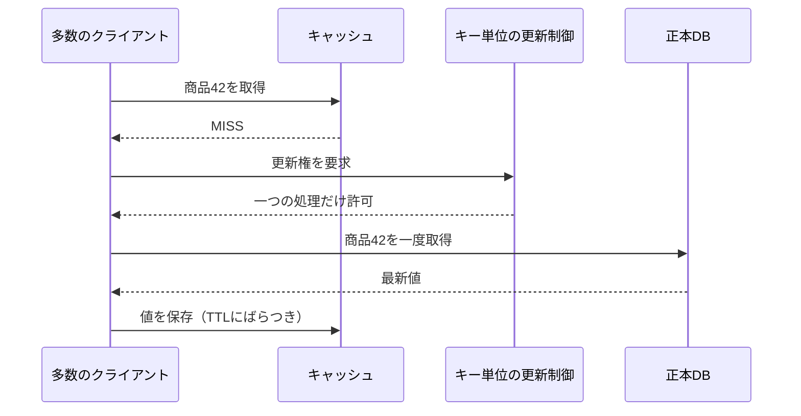

# キャッシュ（Caching）

## 1. 一言でいうと

**キャッシュとは、再取得・再計算できるデータの複製を近くに置き、正本へのアクセスと待ち時間を減らす仕組みです。**

速さと引き換えに、古い値、失効、容量上限、障害時の再構築という問題が加わります。何を正本とするか、最大でどれだけ古くてよいか、ミス時に正本が耐えられるかを説明できなければ、安全なキャッシュ設計とはいえません。

## 2. なぜ必要なのか

商品詳細のように同じ値を何度も読む処理では、毎回DBへ問い合わせるより複製を再利用する方が低遅延で、DB負荷も減ります。一方、安易に追加すると次が起きます。

- 価格を更新しても古い価格が表示される
- 人気キーのTTLが切れ、同時要求がDBへ集中する
- 存在しない商品IDを何度も検索され、毎回DBミスになる
- Redis障害時に全要求がDBへ流れ、二次障害になる
- ヒット率は高いが、巨大な値の転送で遅い

キャッシュは性能部品であると同時に、障害時の負荷経路を変える部品です。

## 3. 仕組み

### 4.1 配置

| 配置 | 共有範囲 | 主な用途 | 注意点 |
|---|---|---|---|
| ブラウザ・HTTPキャッシュ | 利用者端末 | 静的資産、GET応答 | `Cache-Control`、認証情報、再検証 |
| CDN | 地理的なエッジ | 画像、静的資産、共有可能な応答 | キャッシュキー、Vary、削除伝播 |
| アプリ内メモリ | 一プロセス | 小さな参照データ、計算結果 | インスタンス間で値が違う、再起動で消える |
| 分散キャッシュ | 複数プロセス | セッション、商品、レート制御 | ネットワーク障害、容量、ホットキー |

### 4.2 読み書き戦略

- **Cache-Aside**: アプリがキャッシュを読み、ミスならDBから取得して保存する。更新時はDB更新後に削除または更新する
- **Read-Through / Write-Through**: キャッシュ層が正本との読み書きを同期的に仲介する
- **Write-Behind**: 先にキャッシュへ書き、正本へ非同期反映する。書き込みを速くできるが、消失や順序の設計が難しい

Cache-Asideは単純ですが、DB更新とキャッシュ削除は通常一つの原子操作ではありません。短い不整合期間、削除失敗、競合する読み込みを前提にします。

### 4.3 TTL、無効化、エビクション

TTLは「正しさが保証される時間」ではなく、そのキーを自動失効させる期限です。更新イベントで無効化しても、取りこぼしへの安全網としてTTLを併用できます。

エビクションはメモリ上限到達時にキーを追い出す動作です。LRUやLFUなどの方針は製品実装によって近似的な場合があります。TTL切れと容量追い出しを区別し、永続データとキャッシュデータを同じインスタンスへ混在させる場合は方針に注意します。

### 4.4 スタンピード



他の要求は短く待つ、古い値を返す、または負荷制御して失敗させます。分散ロックそのものが停止点にならないよう、期限と所有権トークンを持たせます。

## 4. 具体例：商品詳細をCache-Asideで読む

前提はPostgreSQLが商品の正本、Redisは失っても再構築できる複製です。入力は `productId=42`、期待結果は許容鮮度内の商品情報です。

```text
function getProduct(42):
  value = cache.get("product:v3:42")
  if value exists:
    return value

  value = database.findProduct(42)
  if value does not exist:
    cache.set("product-missing:v1:42", true, shortTTL)
    return notFound

  cache.set("product:v3:42", value, ttlWithJitter)
  return value
```

キーにスキーマ版を含めると、形式変更時に旧値を誤読しにくくなります。存在しない値を短時間だけ記録するネガティブキャッシュはDB負荷を抑えますが、商品作成直後まで404にしないようTTLを短くします。

価格更新では、まずDBトランザクションをコミットし、その後キャッシュを削除します。削除失敗をイベントや再試行で補い、古い価格を許容できない決済時にはキャッシュ値を信用せず正本で再検証します。

## 5. いつ使うか・使わないか

- 読み取りが多く、同じ結果が繰り返され、再取得コストが高い処理に使う
- 静的資産や共有可能なGET応答では、まずHTTPキャッシュやCDNを検討する
- 常に最新でなければ損害が出る残高・決済判断を、キャッシュだけで確定しない
- ヒット率が低く値も安い処理へ、運用対象を増やしてまで導入しない
- 正本の障害を隠し続ける目的で、期限不明の古い値を返さない

「何ミリ秒速くなるか」だけでなく、正本の負荷削減量と不整合の業務影響を比較します。

## 6. 設計上の選択肢とトレードオフ

| 判断 | 利点 | 代償 |
|---|---|---|
| TTLを短くする | 古い期間を短縮 | ミスと正本負荷が増える |
| TTLを長くする | ヒット率を高める | 無効化失敗時に古さが長引く |
| 更新時に削除する | 次の読み取りで正本から再生成 | ミス時の遅延、競合再投入 |
| 更新時に値も書く | 直後のミスを減らす | DBとキャッシュの二重書き整合性 |
| 古い値を返して裏で更新 | 尾部遅延と集中を抑える | 利用者が古い値を見る |
| ローカル + 分散の二段 | さらに低遅延 | 無効化経路と観測が複雑 |

TTLは一律ではなく、価格、説明文、在庫表示の許容鮮度ごとに決めます。同じ時刻に大量失効しないよう、ランダムなばらつきを加えることも有効です。

## 7. よくある失敗と運用上の注意

### ヒット率だけを成功指標にする

要求数ベースのヒット率に加え、節約したDB時間、キャッシュ応答時間、値サイズ、追い出し、正本へのミス負荷を見ます。

### キャッシュ障害時に無制限でDBへ迂回する

DB容量を超えて二次障害になります。同時実行制限、レート制限、古い値、段階的縮退を準備し、キャッシュ停止訓練を行います。

### 更新と無効化の順序を決めない

キャッシュを先に削除すると、DBコミット前の読み取りが古い値を再投入する場合があります。競合を図にし、削除再試行やバージョン付きキーを使います。

### ホットキーを見落とす

全体容量に余裕があっても、一つのキーやシャードへ要求が集中します。キー別の負荷、ネットワーク帯域、値サイズを観測し、ローカル複製や要求集約を検討します。

## 8. 第三者へ説明する

### 30秒で説明するなら

> キャッシュは、再取得できるデータの複製を利用者の近くに置き、待ち時間と正本負荷を減らします。その代わり古い値、失効、容量、障害時のDB集中が増えます。正本、許容鮮度、TTLと無効化、スタンピード対策、キャッシュ停止時の縮退をセットで設計します。

### 3分で説明するなら

1. キャッシュは正本ではなく再構築可能な複製だと定義する。
2. ブラウザ、CDN、アプリ内、Redisの配置差を説明する。
3. 商品詳細のCache-Asideでヒット、ミス、DB取得を示す。
4. 価格更新時の削除競合と、決済時に正本を確認する理由を説明する。
5. TTL、ジッター、要求集約、縮退、観測でスタンピードを防ぐと結ぶ。

## 9. ケース問題・追加質問

### ケース問題

セール開始時に人気商品のキャッシュが失効し、DBが停止しました。再発防止策を説明してください。

::: details 模範回答
TTLをセール開始と同時に切れないよう事前更新し、キーごとにTTLへジッターを入れます。ミス時は一つの処理だけがDBから再生成し、他は短時間待つか許容範囲の古い値を返します。キャッシュ障害時もDBへ流す同時実行数を制限します。価格確定は別途正本で検証します。ミス率、再生成時間、DB流入数、ホットキーを監視し、負荷試験で縮退動作を確認します。
:::

### よくある追加質問

**Q. TTLをゼロにすれば不整合はなくなりますか？**

実質的にキャッシュの利点を失います。また同時処理や多段キャッシュの不整合は別問題です。許容鮮度と無効化方法を要件から決めます。

**Q. Redisを使えばすべて高速になりますか？**

ネットワーク往復、シリアライズ、巨大な値、ホットキーがあるため保証されません。元の問い合わせより高くなることもあり、計測が必要です。

**Q. LRUなら最も不要なキーが必ず消えますか？**

「最近使われていない」を価値の低さとみなす近似です。製品によってサンプリング実装もあり、業務上の重要度を保証しません。

## 10. まとめ

- キャッシュは再構築可能な複製であり、正本を明確にする。
- 配置と戦略は共有範囲、鮮度、障害境界から選ぶ。
- TTLは業務上の許容鮮度と正本容量から決める。
- 無効化失敗、同時ミス、ホットキー、キャッシュ停止を設計に含める。
- ヒット率だけでなく、遅延、正本負荷、追い出し、古い値を観測する。

## 11. 参考資料

- [RFC 9111: HTTP Caching](https://www.rfc-editor.org/rfc/rfc9111.html)
- [Redis: Cache eviction](https://redis.io/docs/latest/develop/reference/eviction/)
- [Redis: Keyspace notifications](https://redis.io/docs/latest/develop/use/keyspace-notifications/)
- [AWS Builders' Library: Caching challenges and strategies](https://aws.amazon.com/builders-library/caching-challenges-and-strategies/)
- [Cloudflare: Cache concepts](https://developers.cloudflare.com/cache/concepts/)
