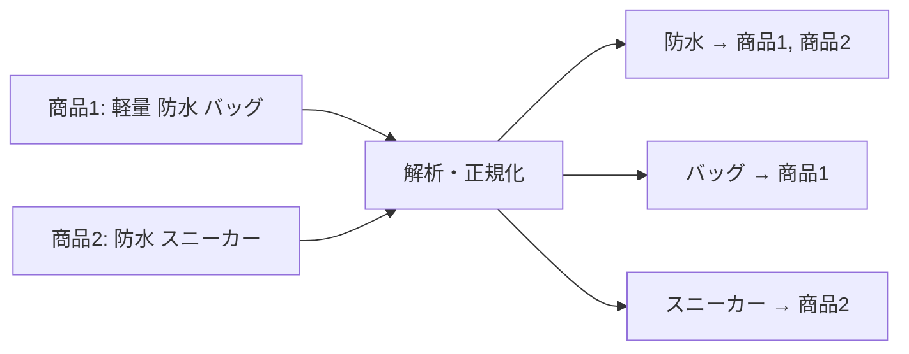
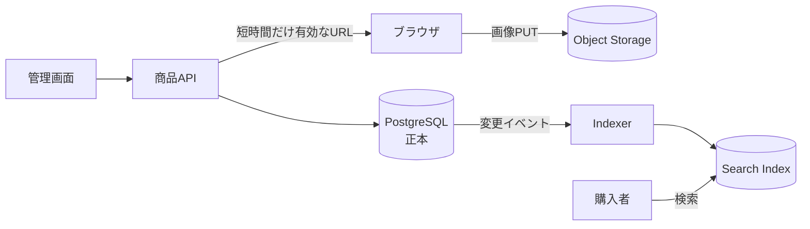

# データとストレージ（Data & Storage Systems）

## 1. 一言でいうと

**ストレージ設計とは、データをどこへ置くかではなく、どの読み書き、整合性、保持期間、障害復旧を保証するかを決めることです。**

万能な保存先はありません。注文にはトランザクション、商品画像には大容量データの保存と配信、商品検索には全文検索が重要です。用途別のストレージを組み合わせる考え方を**ポリグロット・パーシステンス**と呼びます。ただし種類を増やすほど、同期、監視、バックアップ、権限管理も増えます。

## 2. なぜ必要なのか

ECサイトの注文と在庫は関連更新をまとめて成功または失敗させたい一方、画像は大きく、行の結合や部分更新をほとんど必要としません。商品名には表記ゆれや絞り込みがあり、アクセス数は時刻範囲で集計します。

最初から全用途へ専用品を入れる必要はありません。まずRDBで要件を満たせるか確かめ、実測した容量・遅延・機能上の問題から分離します。

## 3. 仕組み

### 4.1 代表的な保存先

| 種類 | 得意な処理 | 主な制約 |
|---|---|---|
| RDB | 関連データ、制約、結合、ACIDトランザクション | 大容量バイナリや高度な全文検索は別方式が有利なことがある |
| オブジェクトストレージ | 画像、動画、バックアップのオブジェクト単位保存 | 通常は行更新、結合、複数オブジェクトのDBトランザクションを提供しない |
| 検索エンジン | 全文検索、関連度、ファセット | 正本との同期遅延、再索引が必要 |
| 時系列DB | 時刻範囲の追記・集計・保持期間管理 | 一般的な業務トランザクションには向かない |
| ドキュメントDB | 一まとまりで読むJSON状データ、変化する属性 | データ重複や横断的な関係・制約に注意が必要 |

製品名ではなく「どのキー・条件で、何件を、どの頻度・遅延で読むか」から選びます。

### 4.2 転置インデックス

検索エンジンは文章をトークンへ分け、トークンから文書への対応表を作ります。



検索速度は語の出現頻度、条件、索引構成、キャッシュに依存し、「常にO(1)」ではありません。RDBから検索索引への反映は非同期になりやすいため、結果整合性を前提にします。

## 4. 具体例：ECサイトの商品登録と検索

商品名・価格・公開状態はPostgreSQL、画像本体はS3、検索用の複製はOpenSearchへ置く例です。



```http
# 前提: 利用者は認証済みで product-42 の画像を更新できる
POST /products/42/image-upload
Content-Type: application/json

{"contentType":"image/jpeg","size":184320}

# 期待結果: API本体を経由せず、限定された保存先へPUTできる短命URL
HTTP/1.1 200 OK
{"uploadUrl":"https://storage.example/...","objectKey":"products/42/main.jpg"}
```

署名付きURLはURLを知る人が権限を行使できるため、有効期限、キー、HTTPメソッド、種類、最大サイズを制限します。アップロード後の検査が終わるまで公開状態にしない設計も必要です。

## 5. いつ使うか・使わないか

### 専用ストレージを検討する場合

- 高度な全文検索や関連度順がプロダクトの中核である
- 大容量オブジェクトを多数保存・配信する
- 時系列データの高頻度な追記、期間集計、保持期間管理が中心である
- RDBで計測した容量・遅延・コストの問題が解消しにくい

### まだ増やさない方がよい場合

- RDBの索引や標準全文検索で要件を満たせる
- 同期遅延を受け入れられず、二つの正本を作ることになる
- 追加製品のバックアップ、権限、監視、復旧を運用できない

## 6. 設計上の選択肢とトレードオフ

| 判断軸 | 確認する問い |
|---|---|
| 読み書き | 主キー参照、全文検索、範囲集計、追記のどれが中心か |
| 整合性 | 書き込み直後に同じ値を読める必要があるか |
| データ量 | 現在量、増加率、オブジェクトサイズはどうか |
| 保持 | 削除期限、法的保持、アーカイブ、復元時間はどうするか |
| 可用性 | どの障害まで耐え、RPO・RTOをいくつにするか |
| 運用 | スキーマ変更、再索引、バックアップを誰が担うか |

複数ストレージを使う場合は正本を一つに決めます。検索索引を失っても正本から再構築できるよう、同期位置と再投入手順を用意します。

## 7. よくある失敗と運用上の注意

### 公称値をシステム保証だと思う

耐久性と可用性は別です。サービスの耐久性が高くても誤削除や権限ミスは防げません。バージョニング、削除保護、バックアップ、復元訓練を組み合わせます。

### 検索索引を無条件に正本にする

検索エンジンは検索に強い一方、業務制約や複数レコードのトランザクションはRDBと同じではありません。注文・決済は必要な保証を持つDBを正本にします。

### 同期の失敗を観測しない

イベントの欠落、重複、順序逆転に備え、冪等な更新、再試行、DLQ、再索引を用意します。正本との差分、最終反映時刻、失敗数を監視します。

## 8. 第三者へ説明する

### 30秒で説明するなら

> ストレージはデータ形式ではなく、読み書き、整合性、保持、復旧の要件で選びます。ECサイトなら注文はRDB、画像はオブジェクトストレージ、全文検索は検索エンジンが候補です。専用化すると機能を得られますが同期と運用が増えるため、正本を明確にして必要な部分から導入します。

### 3分で説明するなら

1. 注文、画像、検索、メトリクスではアクセスパターンが違うと示す。
2. 各ストレージの得意分野と保証を比較する。
3. ECサイトではRDBを正本、画像をオブジェクトストレージ、検索を派生索引にする例を示す。
4. 同期の遅延、重複、欠落へ備えて再構築可能にすると説明する。
5. 性能だけでなくRPO・RTO、保持、権限、運用コストで判断すると結ぶ。

## 9. ケース問題・追加質問

### ケース問題

1万商品だけの新規ECサイトで「将来に備えて検索エンジンを入れたい」と提案されました。どう判断しますか。

::: details 模範回答
必要な検索条件、応答時間、更新反映時間を定義し、まずRDBの索引や全文検索で計測します。それで要件を満たすなら初期はRDBを選びます。表記ゆれ、関連度、ファセット、検索負荷が中核要件になった時点で検索エンジンを追加します。その際もRDBを正本とし、再索引手順と同期遅延の監視を用意します。
:::

### よくある追加質問

**Q. NoSQLはRDBより速いですか？**

一概にはいえません。製品、データモデル、索引、負荷、整合性設定で変わるため、代表クエリを実データ量で測ります。

**Q. 画像をDBへ保存してはいけませんか？**

禁止ではありません。小規模で一括トランザクションを優先するなら妥当な場合もあります。容量、WAL、バックアップ時間、配信方法を測って比較します。

## 10. まとめ

- アクセスパターン、整合性、保持、復旧の要件から選ぶ。
- 各ストレージには異なる強みがある。
- 種類を増やすほど同期、監視、復旧の負担も増える。
- 正本を明確にし、派生データを再構築可能にする。
- 公称値ではなく代表クエリで検証する。

## 11. 参考資料

- [Amazon S3 User Guide: Sharing objects with presigned URLs](https://docs.aws.amazon.com/AmazonS3/latest/userguide/ShareObjectPreSignedURL.html)
- [Amazon S3 User Guide: Managing the lifecycle of objects](https://docs.aws.amazon.com/AmazonS3/latest/userguide/object-lifecycle-mgmt.html)
- [Elasticsearch Reference: Inverted index](https://www.elastic.co/docs/manage-data/data-store/index-basics)
- [PostgreSQL Documentation: Full Text Search](https://www.postgresql.org/docs/current/textsearch.html)
- [MongoDB Manual: Data Modeling](https://www.mongodb.com/docs/manual/data-modeling/)
