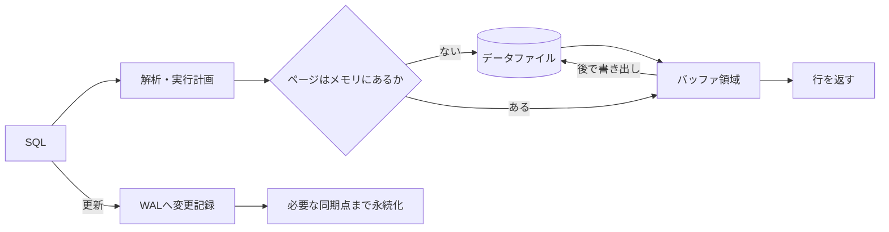

# データベース内部構造（Database Internals）

## 1. 一言でいうと

**データベース内部構造とは、論理的な行とトランザクションを、メモリ上のページ、ログ、複数の行バージョン、ディスク上の索引へ対応づける仕組みです。**

アプリからは一つの `UPDATE` に見えても、内部ではロック、行バージョン作成、WAL記録、バッファ変更、後日の書き出しと掃除が行われます。この流れを知ると、遅い理由やディスク障害時の保証を、設定名の暗記ではなく因果関係で説明できます。

## 2. なぜ必要なのか

- メモリに載っている間は速いが、キャッシュミスで突然I/Oが増える
- 長時間トランザクションが古い行バージョンの回収を妨げる
- チェックポイント付近で書き込みが集中する
- 二つの更新が互いのロックを待ち、デッドロックになる
- WALを保存していても、復元手順や同期設定が要件を満たさない

内部構造は製品ごとに異なります。一般原理とPostgreSQL固有の挙動を区別し、実際のバージョンの公式資料とメトリクスで確認します。

## 3. 仕組み

### 4.1 読み書きの経路



更新したデータページを毎回即座に書き出す代わりに、復旧に必要なWAL（Write-Ahead Log）を先に永続化します。クラッシュ後はWALを再生して、データファイルへ未反映だった変更を復元します。WALがあるだけでデータ損失がゼロになるわけではなく、コミット時の同期設定、ストレージ、レプリカ確認方法が保証を決めます。

### 4.2 B-treeとLSM-tree

| 観点 | B-tree系 | LSM-tree系 |
|---|---|---|
| 基本 | ソートされたページ木を更新 | メモリへ書き、ソート済みファイルへ順次フラッシュ |
| 得意 | 点検索、範囲検索、安定した読み取り | 高い追記スループット |
| 後処理 | ページ分割、空き領域管理 | compactionで複数ファイルを統合 |
| 代償 | ランダム書き込みやページ分割 | 読み取り増幅、compactionのI/O、空間増幅 |

実装は単純な二択ではありません。B-treeを使うDBもWALへ順次書き込み、LSM-treeもWALやキャッシュを使います。「B-treeは常に読み取り向け」「LSMは順次I/Oだけ」と断定せず、ワークロードと実装を測定します。

### 4.3 MVCC

MVCC（Multi-Version Concurrency Control）は、更新前後の行バージョンとスナップショットから、各トランザクションに見せる行を決めます。PostgreSQLでは更新時に新しいタプル版を作るため、通常の読み取りと書き込みは互いにブロックしにくくなります。ただし、同じ行の更新、DDL、明示ロックなどでは待ちが発生します。

不要になった古い版はVACUUMが回収可能にし、統計情報や可視性情報も保守します。長時間トランザクションが古いスナップショットを保持すると、回収できず表やインデックスが膨らむ原因になります。

### 4.4 ロックとデッドロック

デッドロックは、処理Aが商品1をロックして商品2を待ち、処理Bが商品2をロックして商品1を待つような循環です。DBは検出すると一方を中止します。アプリはトランザクション全体を再試行可能にし、ロック順序を揃え、トランザクションを短くします。

## 4. 具体例：在庫更新の内部で起きること

前提は商品101に在庫があり、入力は1個の購入、期待結果は在庫が一度だけ減り、コミット済み結果がクラッシュ後も復旧できることです。

```sql
BEGIN;
UPDATE inventory
SET quantity = quantity - 1
WHERE product_id = 101 AND quantity >= 1;
COMMIT;
```

概略は次の通りです。

1. 実行器がインデックスまたは表走査で対象行を探す。
2. 更新競合を制御し、条件を再確認する。
3. PostgreSQLでは新しい行バージョンを作り、バッファ上のページを変更する。
4. 変更を表すWALレコードを作る。
5. 設定された永続性条件を満たしてコミット成功を返す。
6. データページはチェックポイントなどで後から書き出される。
7. 古い行バージョンは誰からも見えなくなった後、VACUUMで再利用可能になる。

この流れにより、WAL量、バッファヒット率、ロック待ち、古い行の増加を監視する理由がつながります。

## 5. いつ使うか・使わないか

- 実行計画だけでは説明できないI/O、書き込み揺れ、膨張、ロック待ちの診断に内部知識を使う
- DB製品やバージョンの実装詳細を、別製品へそのまま当てはめない
- 根拠なくバッファやWAL設定を変更せず、メモリ総量、復旧時間、I/Oを測る
- 一般的なCRUDの段階で独自ストレージエンジンを作らない
- ベンチマーク結果を本番の読み書き比率、データ分布、耐久設定なしに一般化しない

## 6. 設計上の選択肢とトレードオフ

| 判断 | 強めるもの | 代償 |
|---|---|---|
| 大きいバッファ領域 | ディスク読み取りの削減 | 他プロセスとのメモリ競合、復旧後のコールド状態 |
| 頻繁なチェックポイント | 復旧時の再生量を抑えやすい | 通常時の書き込みI/Oが増える |
| 同期コミット | 確認済み更新の耐久性 | 書き込みレイテンシ |
| 高い分離 | 並行実行の異常を減らす | 待ちや中止・再試行が増える場合がある |
| LSM compactionを強める | 読み取りと空間を改善 | バックグラウンドI/Oが増える |

復旧時点目標（RPO）と復旧時間目標（RTO）を先に決めると、WAL保存、レプリケーション、チェックポイント、バックアップの判断を説明しやすくなります。

## 7. よくある失敗と運用上の注意

### MVCCならロック待ちがないと思う

同じ行の書き込み同士は競合し、外部キーやDDLもロックへ影響します。待機イベントとブロッキング元を調べます。

### 長時間トランザクションを放置する

接続を開いたままの `idle in transaction` も古い版の回収やロック解放を妨げます。時間制限と監視を設けます。

### VACUUMを単なる容量削減と考える

PostgreSQLのVACUUMはMVCCの古い版管理やトランザクションID周回対策に不可欠です。テーブルの更新量に合わせてautovacuumの進捗と遅延を監視します。

### デッドロック時に文だけ再実行する

トランザクションは中止されているため、処理全体をロールバックし、バックオフして再試行します。外部副作用をトランザクション内の再試行へ混ぜないよう設計します。

## 8. 第三者へ説明する

### 30秒で説明するなら

> DBはデータを直接毎回ディスクへ書くのではなく、メモリ上のページを使い、復旧用WALを先に永続化します。MVCCは複数の行バージョンからトランザクションに見える値を決めます。速さと耐久性の裏側には、チェックポイント、VACUUM、ロック、compactionなどの後処理があり、それらの滞りを監視します。

### 3分で説明するなら

1. SQLをページ、ログ、行バージョンへ対応づける層だと定義する。
2. 読み取りがバッファを経由し、更新ではWALを先に記録すると説明する。
3. B-treeとLSM-treeの読み書き・後処理の差を比較する。
4. 在庫更新を例にMVCC、ロック、コミット、VACUUMを順に示す。
5. 内部処理の遅れをI/O、待機、WAL、古い行のメトリクスで確認すると結ぶ。

## 9. ケース問題・追加質問

### ケース問題

更新量は変わらないのに表サイズとVACUUM時間が増え続けています。何を調べますか。

::: details 模範回答
長時間トランザクションや `idle in transaction` が古いスナップショットを保持していないか、削除・更新で不要タプルが増えていないか、autovacuumが更新量に追いついているかを確認します。表だけでなくインデックス膨張、WAL量、I/O、レプリカ側の保持要因も調べます。すぐ全面VACUUMを実行するのではなく、ブロッキング要因と容量余裕を確認し、トランザクション短縮やテーブル別設定を検討します。
:::

### よくある追加質問

**Q. WALとバックアップは同じですか？**

いいえ。WALは変更の再生に使えますが、復元の基点となるバックアップ、保持期間、破損や誤操作から隔離した保管が別途必要です。

**Q. B-treeの検索は常にO(log N)ですか？**

木の探索自体を説明する目安にはなりますが、実際の時間はページキャッシュ、範囲の行数、ランダムI/O、行の取得などにも左右されます。

## 10. まとめ

- DBは論理的な操作を、ページ、WAL、行バージョンへ変換する。
- B-treeとLSM-treeは読み書きと後処理のトレードオフが異なる。
- WAL先行書き込みがクラッシュ復旧を支える。
- MVCCは競合を減らすが、古い版の回収とロック管理が必要である。
- RPO/RTOと実測値から耐久性・性能設定を判断する。

## 11. 参考資料

- [PostgreSQL: Write-Ahead Logging](https://www.postgresql.org/docs/current/wal-intro.html)
- [PostgreSQL: Concurrency Control](https://www.postgresql.org/docs/current/mvcc.html)
- [PostgreSQL: Routine Vacuuming](https://www.postgresql.org/docs/current/routine-vacuuming.html)
- [PostgreSQL: Database Page Layout](https://www.postgresql.org/docs/current/storage-page-layout.html)
- [RocksDB Wiki: Basics](https://github.com/facebook/rocksdb/wiki/RocksDB-Basics)
