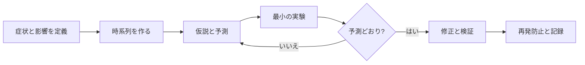

# 体系的なデバッグ（Systematic Debugging）

## 1. 一言でいうと

**デバッグとは、観測した症状から考えられる原因を列挙し、予測を伴う仮説を証拠と安全な実験で一つずつ絞り込む作業です。**

「DBが怪しい」は推測です。「DB接続待ちが増えたため注文APIのp99だけが悪化した。プール上限を上げれば待ち時間が下がるはず」は検証可能な仮説です。

## 2. なぜ必要なのか

分散システムでは、見えている場所と原因の場所が一致しません。APIの502はプロキシ、アプリ、DB、DNS、証明書、依存先のどこでも起こり得ます。焦って設定を複数変えると、何が効いたか分からず、新しい障害も作ります。

体系的な手順には三つの利点があります。

- 利用者影響を先に抑えられる
- 証拠のない思い込みを減らせる
- 後から同じ症状を速く診断できる

## 3. 仕組み：診断ループ



### 4.1 最初に症状を狭く定義する

- いつ始まり、今も続いているか
- 誰の、どの操作が、どの割合で失敗するか
- 期待値と実測値は何か
- 特定リージョン、バージョン、商品、テナントに偏るか
- 直前にコード、設定、データ、依存先の変更があったか

「サイトが遅い」ではなく「15:02以降、東京リージョンの注文POSTのp99が200 msから4 sへ上昇し、8%がタイムアウト」のように表します。

### 4.2 観測手段を選ぶ

| 手段 | 得意な問い | 例 |
|---|---|---|
| メトリクス | いつ・どれほど・どこが飽和したか | エラー率、p99、接続待ち |
| ログ | そのイベントで何が起きたか | 注文ID、エラー分類、状態遷移 |
| トレース | 一つの要求がどこで時間を使ったか | API → DB → 決済API |
| プロファイル | CPUやメモリを何が消費したか | ホット関数、割り当て、ロック待ち |

相関IDやトレースIDで結び、個人情報や認証情報は記録しません。

### 4.3 仮説は予測と組にする

```text
仮説: DB接続プールが枯渇している
根拠: 接続待ちとAPI遅延が同時に上昇した
予測: DB処理時間は平常だが、接続取得時間だけが長い
確認: プール待ち時間、使用中接続数、DB側セッション数を比較
反証: 接続に余裕があり、処理時間自体が長ければ棄却
```

## 4. 具体例：注文APIだけが遅い

1. ダッシュボードで影響を注文POSTに限定する。
2. デプロイ時刻と悪化開始時刻を同じ時系列に置く。
3. トレースを成功・失敗・旧版・新版で比較する。
4. DB区間が長ければ、クエリ時間と接続待ち時間を分ける。
5. 新版だけ接続を返却していないと分かったら、まずトラフィックを旧版へ戻す。
6. 最小の再現テストを作り、接続解放の修正前に失敗、修正後に成功することを確認する。
7. プール待ち時間のアラートと回帰テストを追加する。

切戻しで症状が消えても、原因の理解と再発防止は別に行います。

## 5. いつどの調査を使うか

- **直後の変更がある**: 旧版との比較、段階切戻し、設定差分
- **一部の要求だけ遅い**: 分散トレース、入力・テナント別の分布
- **全体が徐々に遅い**: 容量、キュー長、GC、接続、メモリ推移
- **CPUが高い**: サンプリングプロファイル、ホットパス
- **メモリが増え続ける**: ヒープ差分、保持参照、割り当て率
- **再現しない**: 本番条件の記録、合成要求、障害前後の比較

まず安価で広い観測から始め、根拠が得られた場所だけ詳細化します。

## 6. 調査方法のトレードオフ

| 方法 | 強み | リスク |
|---|---|---|
| ログ追加 | 文脈を詳しく残せる | 容量、費用、機密情報、再デプロイ |
| 詳細トレース | 経路と時間を可視化 | オーバーヘッド、サンプリング偏り |
| 本番で再現 | 条件差が少ない | 利用者影響、データ変更 |
| ミラー/ステージング | 安全に実験しやすい | 本番負荷やデータとの差 |
| 切戻し | 影響を素早く軽減 | DB変更などは戻せない場合がある |

## 7. よくある失敗と運用上の注意

- **最初の相関を原因と決める**: 同じ原因から同時に変化した可能性を残す。
- **複数変更を同時に行う**: 効果と副作用を識別できない。
- **平均だけを見る**: 分位点と分布、エラー分類で偏りを探す。
- **本番で危険なコマンドを試す**: 読み取りから始め、変更には承認と戻し方を用意する。
- **証拠を保存しない**: 時刻、クエリ、グラフ、仮説、結果をインシデント記録へ残す。
- **犯人探しで終わる**: なぜ検出・隔離・回復できなかったかを仕組みとして直す。

## 8. 第三者へ説明する

### 30秒で説明するなら

> 体系的なデバッグは、症状と影響を数値で定義し、時系列と変更点を集め、予測可能な仮説を安全な実験で絞る方法です。メトリクスで範囲、ログで出来事、トレースで要求経路、プロファイルで資源消費を調べ、影響軽減と根本原因の検証を分けて進めます。

### 3分で説明するなら

1. 利用者影響を確認し、必要なら切戻しや縮退を先に行う。
2. 症状を時間・操作・割合・場所で限定する。
3. 変更と指標を同じ時系列へ並べる。
4. 仮説ごとに「正しければ何が観測されるか」を書く。
5. 成功・失敗、旧・新など一変数の比較で反証する。
6. 修正を再現テストで確認し、監視と手順へ学びを残す。

## 9. ケース問題・追加質問

### ケース問題

デプロイ直後にCPU使用率とエラー率が同時に上がりました。「CPU不足が原因」と結論づけてよいでしょうか。

::: details 模範回答
まだ結論づけられません。両方が同じ不具合の結果かもしれません。新版だけに偏るか、CPUプロファイルのホットパス、要求量、待ち時間、エラー分類を確認します。「特定関数のループが原因なら新版のその関数がCPUを支配する」という予測を検証します。影響が大きければ調査と並行して旧版へ戻します。
:::

**Q. ログを増やせば原因は分かりますか？**

目的のないログはノイズになります。検証したい仮説、必要な識別子、保持期間、機密性を決めて追加します。

**Q. 根本原因は一つですか？**

引き金、潜在条件、検出の遅れ、影響拡大、復旧の遅れが組み合わさることが多いため、単一要因に還元しません。

## 10. まとめ

- 症状・影響・相関・原因を区別する。
- 仮説には、正しい場合の予測と反証条件を付ける。
- 観測手段を問いに応じて使い分ける。
- 一度に一変数を比較し、本番の安全を優先する。
- 修正後は回帰テスト、監視、手順、設計へ学びを戻す。

## 11. 参考資料

- [Google SRE Book: Effective Troubleshooting](https://sre.google/sre-book/effective-troubleshooting/)
- [Google SRE Book: Monitoring Distributed Systems](https://sre.google/sre-book/monitoring-distributed-systems/)
- [OpenTelemetry Documentation: Traces](https://opentelemetry.io/docs/concepts/signals/traces/)
- [Go Documentation: Diagnostics](https://go.dev/doc/diagnostics)
