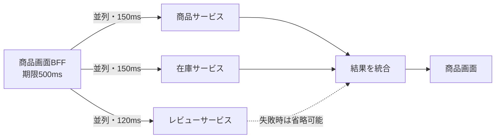

# 分散APIとサービス間通信（Distributed APIs & Inter-Service Communication）

## 1. 一言でいうと

**分散API設計とは、遅延、重複、順序のずれ、部分障害を通常状態として扱い、サービス同士を期限と容量の範囲内で協調させることです。**

呼び出し元がタイムアウトしても、呼び出し先で処理が成功した可能性があります。ネットワークが通っても相手の処理能力が残っているとは限りません。そのため、通信方式だけでなく、結果不明、再送、過負荷、観測まで契約にします。

## 2. なぜ必要なのか

注文APIが在庫、決済、配送、通知を順に同期呼び出しすると、一つの遅延が利用者の待ち時間とワーカー占有へ伝わります。各サービスが99.9%利用可能でも、すべての成功を必要とする呼び出しが増えるほど全体の成功率は下がります。

- 一段ごとの再試行が掛け算になり、障害中の負荷を増幅する
- 上流は応答を諦めたのに、下流は処理を続ける
- 一つの集約APIが多数の下流を呼び、最遅の応答を待つ
- メッセージが重複配信され、決済や在庫減算が二重になる
- サービスの宛先変更や縮退がクライアントへ反映されない

分割で得たい独立性は、障害時の振る舞いを設計して初めて得られます。

## 3. 仕組み

### 4.1 同期と非同期

| 方式 | 呼び出し元が得るもの | 向く例 | 引き受ける複雑さ |
|---|---|---|---|
| 同期HTTP/gRPC | その場で結果または失敗 | 商品参照、認可、即時見積もり | 時間的結合、期限、連鎖障害 |
| キュー・イベント | 受付後に別の処理が進む | メール、分析、出荷指示 | 重複、順序、遅延、結果整合性 |

非同期なら必ず疎結合になるわけではありません。イベントの内部形式へ購読者が強く依存したり、実質的に即時応答を待ったりすれば結合は残ります。

### 4.2 デッドラインと再試行

タイムアウトは一回の待ち時間、デッドラインは処理全体を終える時刻です。上流に残り800msしかなければ、下流へ2秒のタイムアウトを渡してはいけません。各段は通信と処理の余裕を引いて短い期限を設定し、キャンセルを伝えます。

再試行は一時的な失敗に有効ですが、試行回数、バックオフ、ジッター、再試行可能なエラー、冪等性、全体期限が必要です。複数層で再試行せず、責任を一箇所へ寄せます。

### 4.3 Fan-Out / Fan-In



並列化は合計時間を短縮できますが、下流への同時要求数を増やします。すべて必須なら最遅サービスが全体を決めます。各依存を「必須」「省略可」「古い値で代替可」に分類します。

### 4.4 サービス発見と負荷制御

クライアントはDNS、サービスレジストリ、プロキシなどから正常な宛先を知ります。ただし発見は容量保証ではありません。接続上限、同時実行数、キュー長、レート制限、サーキットブレーカーで下流を守ります。

## 4. 具体例：注文確定フロー

前提は注文が `PENDING`、入力は `orderId=ord_42` と一意な操作ID、期待結果は注文が一度だけ確定し、後続処理が最終的に開始されることです。

```text
1. 注文APIが在庫確保を同期呼び出し（残り期限を渡す）
2. 成功したら注文状態と OrderConfirmed イベントを同じDBトランザクションで保存
3. Outboxワーカーがイベントをメッセージ基盤へ送る
4. メール・配送サービスがイベントIDを記録して重複を無害化
```

通知まで同期で待たないため、メール障害で注文確定は失敗しません。一方、利用者へは「注文受付済み」であり「メール送信済み」ではないと、状態の意味を明確に返します。

## 5. いつ使うか・使わないか

- 即時の判断が必要で、呼び出し先なしでは応答を作れないなら同期通信を使う
- 後続処理を遅らせられ、負荷を平準化したいなら非同期通信を検討する
- 境界と運用理由がなければ、同一プロセスの処理を分散APIへ分けない
- 書き込みや副作用のある処理へ、冪等性なしのヘッジングを使わない
- 小さなシステムでキューの監視、再処理、デッドレター運用を担えないなら単純な構成を優先する

## 6. 設計上の選択肢とトレードオフ

| 選択 | 得られるもの | 代償 |
|---|---|---|
| 同期RPC | 即時結果、単純な制御フロー | 時間的結合と連鎖障害 |
| 非同期メッセージ | 負荷平準化、時間的な分離 | 結果整合性と重複対策 |
| 再試行 | 一過性障害からの回復 | 負荷増幅と重複処理 |
| サーキットブレーカー | 失敗先への呼び出しを早く止める | 閾値、半開状態、代替応答の設計 |
| ヘッジング | 一部の遅い読み取りを別試行で回避 | 追加負荷、キャンセル、同一結果の保証 |

ヘッジングの効果や追加トラフィック量は待機閾値と遅延分布で変わります。「5%増で必ずp99が半減」のような一般則ではありません。

## 7. よくある失敗と運用上の注意

### すべての層で再試行する

3層がそれぞれ3回試すと、最悪時の下流要求は急増します。再試行の所有者を決め、全体の試行予算を設けます。

### タイムアウトとキャンセルを混同する

上流が待つのをやめても、下流が自動的に止まるとは限りません。プロトコルと実装がキャンセルを伝え、処理が安全な地点で中止するか確認します。

### 「Exactly Once」を前提にする

多くの通信基盤では、障害境界を越えた厳密な一回実行を簡単には保証できません。少なくとも一回の配信と、消費側の重複排除・冪等処理を組み合わせます。

### 下流別の観測がない

サービス名、操作名、試行回数、期限切れ、キュー滞留、フォールバック数をメトリクスと分散トレースで追います。高カーディナリティなIDを無制限にメトリクスラベルへ入れないよう注意します。

## 8. 第三者へ説明する

### 30秒で説明するなら

> 分散APIでは、ネットワーク遅延、部分障害、結果不明、重複を通常状態として扱います。即時結果が必要なら期限付きの同期RPC、遅らせられる処理なら重複を無害化した非同期通信を使います。再試行とFan-Outは負荷を増やすため、予算、容量制限、フォールバック、観測まで設計します。

### 3分で説明するなら

1. リモート呼び出しには結果不明と部分障害があると定義する。
2. 注文確定の必須処理を同期、通知を非同期にする理由を示す。
3. 上流のデッドラインを下流へ伝え、無駄な処理を止めると説明する。
4. 再試行、Fan-Out、ヘッジングが負荷を増幅する点を示す。
5. 冪等性、同時実行制限、トレースで障害を閉じ込めると結ぶ。

## 9. ケース問題・追加質問

### ケース問題

商品画面が商品、在庫、レビュー、推薦の4サービスを呼び、推薦の遅延だけで全画面が失敗します。どう改善しますか。

::: details 模範回答
まず各データが画面成立に必須か分類します。商品と価格は必須、レビューと推薦は省略可能とします。全体期限から依存ごとの短い期限を割り当て、並列呼び出しし、省略可能な応答は空表示や短時間キャッシュへフォールバックします。同時実行数を制限し、推薦への無条件再試行は避けます。サービス別のp95/p99、期限切れ、フォールバック率を観測して予算を調整します。
:::

### よくある追加質問

**Q. タイムアウトは何秒が正解ですか？**

固定の正解はありません。利用者向けSLO、上流の残り期限、通常の遅延分布、下流の処理時間、再試行余地から決めます。

**Q. 非同期通信なら障害に強いですか？**

送信元と処理時刻を分離できますが、ブローカー停止、滞留、重複、毒メッセージが生まれます。再処理と監視があって初めて強みになります。

## 10. まとめ

- リモート呼び出しには遅延、部分障害、結果不明がある。
- 同期と非同期は、即時結果と結果整合性の要件から選ぶ。
- デッドラインとキャンセルを下流へ伝播し、処理予算を守る。
- 再試行やFan-Outは回復力と同時に負荷も増やす。
- 冪等性、容量制限、フォールバック、観測で障害を閉じ込める。

## 11. 参考資料

- [gRPC: Deadlines](https://grpc.io/docs/guides/deadlines/)
- [gRPC: Retry](https://grpc.io/docs/guides/retry/)
- [gRPC: Request Hedging](https://grpc.io/docs/guides/request-hedging/)
- [AWS Builders' Library: Timeouts, retries, and backoff with jitter](https://aws.amazon.com/builders-library/timeouts-retries-and-backoff-with-jitter/)
- [Google SRE Book: Handling Overload](https://sre.google/sre-book/handling-overload/)
