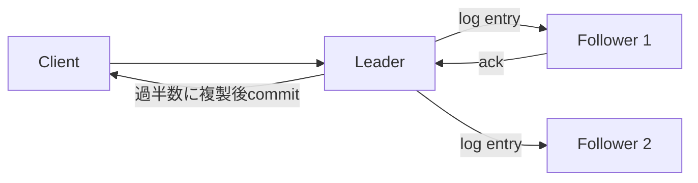

# 分散システム（Distributed Systems）

## 1. 一言でいうと

**分散システムとは、ネットワークで結ばれた複数ノードが協調して一つの機能を提供する仕組みであり、相手の停止と通信遅延を完全には区別できない世界を設計することです。**

複数ノードにすると容量や耐障害性を高められますが、全体が同時に成功・失敗するとは限りません。タイムアウトは「失敗した」という証明ではなく、「期限内に結果を確認できなかった」という観測です。

## 2. なぜ必要なのか

- 一台の容量を超える読み書きやデータ量を扱う
- 一台・一障害領域の故障でもサービスを継続する
- 利用者に近い場所で低遅延に応答する
- チームや業務単位を独立して運用する

対価として、ネットワーク分断、重複、順序逆転、レプリカ遅延、リーダー交代、運用対象の増加を引き受けます。一台で要件を満たせるなら、その単純さは大きな価値です。

## 3. 仕組み

### 4.1 複製と分割

- **レプリケーション**は同じデータの複製を複数ノードへ置き、読み取り容量や耐障害性を得ます。同期複製は確認待ちが増え、非同期複製は遅延・データ損失の窓が生じます。
- **シャーディング**は異なるデータを複数ノードへ分け、容量を広げます。キーの偏り、横断クエリ、再配置が難しくなります。

### 4.2 CAP定理と一貫性

CAP定理は、ネットワーク分断が起きたとき、線形化可能な一貫性と、分断された全ノードが応答を返す可用性を同時には保証できないことを述べます。「三つから常に二つを選ぶ」という製品分類だけではありません。通常時にも、一貫性のための調整と遅延の間に選択があります。

結果整合性は「すぐ同じ」ではなく、新しい更新が止まり通信が回復すれば最終的に収束する性質です。収束まで利用者に何を見せるかも業務設計です。

### 4.3 過半数とRaft



Raftはリーダー選出と複製ログの順序へ合意するアルゴリズムです。通常、過半数が通信できる側だけが前進するため、二つの少数派が独立して確定することを防ぎます。過半数は可用性を無条件に高める魔法ではなく、少数派側は安全のため停止します。

クォーラム型DBの`W + R > N`は読み書き集合の重なりを示しますが、それだけで常に最新値を返すとは限りません。バージョン判定、同時書き込み、障害モデル、実装上の保証も必要です。

## 4. 具体例：ECサイトの在庫引き当て

在庫の正本を一つのリーダーで管理し、注文APIが業務キー付きで引き当てる例です。

```http
# 前提: 同じ注文の再試行では同じキーを使う
POST /inventory/reservations
Idempotency-Key: order-42-item-7
Content-Type: application/json

{"sku":"item-7","quantity":1}

# 期待結果: 応答を失って再送しても、引き当ては一つだけ
HTTP/1.1 201 Created
{"reservationId":"res-801","status":"RESERVED"}
```

リーダーへ到達できない少数派の領域では、在庫確定を拒否する選択ができます。販売を継続する選択なら、領域別在庫枠や後の競合解決など、売り越しをどう扱うかを明示します。これはCAPという名前ではなく業務損失から決めます。

## 5. いつ使うか・使わないか

### 分散化が向く場合

- 実測した容量、可用性、地理的遅延の要件を一台で満たせない
- 障害領域を分ける価値が、運用複雑性を上回る
- 自動化、監視、障害訓練を継続できる

### まだ分散化しない方がよい場合

- 小規模で単一DBの冗長構成により要件を満たせる
- データ所有境界や整合性要件が曖昧
- 「将来必要かもしれない」以外の根拠がない

## 6. 設計上の選択肢とトレードオフ

| 判断 | 得られるもの | 代償 |
|---|---|---|
| 同期複製 | 確認済み更新の損失を減らす | 書き込み遅延、分断時の停止 |
| 非同期複製 | 低遅延、遠距離へ複製しやすい | 遅延読み取り、フェイルオーバー時の損失窓 |
| シャーディング | 容量とスループットを分割 | ホットキー、横断処理、再配置 |
| 強い一貫性 | 単純な不変条件 | 調整コスト、少数派の停止 |
| 結果整合性 | 分断中も受け付けやすい | 競合解決、古い読み取り、業務補償 |

SLO、RPO、RTO、許される古さ、競合時の規則を数値・業務ルールで決めます。

## 7. よくある失敗と運用上の注意

### 壁時計でイベントを完全順序化する

NTPを使っても時計にはずれや修正があります。因果順序にはDBの連番、ログ位置、論理時計など目的に合う仕組みを使います。タイムスタンプは監査には有用でも、単独で因果関係を証明しません。

### タイムアウト直後に別リーダーを立てる

遅い旧リーダーが生きている可能性があります。過半数による選出、リース、任期番号、fencing tokenを使い、古い所有者の書き込みを保存先で拒否します。

### 正常系だけ試す

遅延、パケット損失、ノード停止、ディスク枯渇、時計ずれ、リーダー交代を段階的に試します。レプリケーション遅延、選出時間、拒否率、再試行量、データ照合結果を監視します。

## 8. 第三者へ説明する

### 30秒で説明するなら

> 分散システムは複数ノードで容量や耐障害性を得る仕組みですが、相手の停止と通信遅延を区別できず部分障害が起きます。CAPは分断時に一貫性と全ノードの可用性を同時保証できないことを示します。複製、合意、冪等性、タイムアウトを、業務の許容損失とSLOから選びます。

### 3分で説明するなら

1. 部分障害と不確かなタイムアウトを説明する。
2. 複製とシャーディングの目的を分ける。
3. CAPを分断時の選択として正確に説明する。
4. Raftが過半数でログ順序へ合意する例を示す。
5. EC在庫では売り越しと停止の損失を比較して保証を選ぶと結ぶ。

## 9. ケース問題・追加質問

### ケース問題

二つのリージョン間が分断しました。両方で最後の1個を販売し続けるべきですか。

::: details 模範回答
唯一の正解はありません。売り越しが重大なら、過半数または在庫の所有権を持つ側だけが確定し、他方は待機・拒否します。販売停止の損失が大きいなら、事前に領域別の在庫枠を分配し、その範囲だけ販売する方法があります。分断後の統合で初めて競合を考えるのではなく、業務上の補償と顧客通知を先に決めます。
:::

### よくある追加質問

**Q. ノードを奇数にすれば障害に強いですか？**

合意系では同じ耐故障数なら偶数追加が投票上の利点を増やさない場合があります。ただし配置、負荷、製品仕様も含めて判断します。

**Q. 分散ロックだけで二重実行を防げますか？**

期限切れ後も古い処理が続く可能性があります。保存先が単調増加するfencing tokenを検証する設計がより安全です。

## 10. まとめ

- 分散化は容量・可用性と引き換えに部分障害を持ち込む。
- CAPはネットワーク分断時の保証に関する定理である。
- 複製とシャーディングは目的が異なる。
- 合意は安全性を守るが、分断された少数派は前進できない。
- 業務損失、SLO、RPO・RTOから保証を選ぶ。

## 11. 参考資料

- [Brewer's CAP Theorem: The Gilbert and Lynch paper](https://groups.csail.mit.edu/tds/papers/Gilbert/Brewer2.pdf)
- [In Search of an Understandable Consensus Algorithm (Raft)](https://raft.github.io/raft.pdf)
- [etcd Documentation: How to conduct leader election](https://etcd.io/docs/v3.7/tasks/operator/how-to-conduct-elections/)
- [Google Cloud Spanner Documentation: TrueTime and external consistency](https://cloud.google.com/spanner/docs/true-time-external-consistency)
- [Amazon DynamoDB Developer Guide: Read consistency](https://docs.aws.amazon.com/amazondynamodb/latest/developerguide/HowItWorks.ReadConsistency.html)
