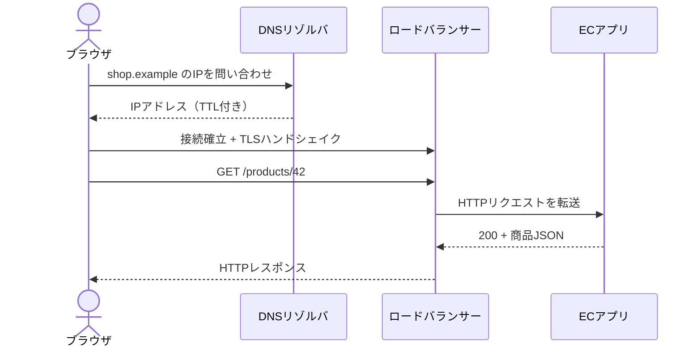

# HTTPとネットワーク（HTTP & Networking）

## 1. 一言でいうと

**HTTPはクライアントとサーバーが要求と応答の意味を共有する規約であり、ネットワーク設計はそのメッセージを安全に、期限内に、障害へ耐えて届けるための設計です。**

HTTPは「GETは表現を取得する」といった意味を定めます。実際の配送には名前をIPアドレスへ変換するDNS、通信路を作るTCPまたはQUIC、暗号化と相手確認を担うTLSなどが関わります。HTTPのバージョンが違っても、メソッドやステータスコードの基本的な意味は共通です。

## 2. なぜ必要なのか

ローカル環境では一瞬で成功するAPIも、本番では途中に複数の機器と通信路があります。

- DNSの応答が遅い、または古い宛先がキャッシュされる
- 新しい接続の確立に複数回のネットワーク往復が必要になる
- ロードバランサーは正常でも、その先のアプリが飽和する
- 下流APIを無期限に待ち、スレッドや接続を使い切る
- 応答が失われ、処理が成功したかクライアントから判断できない

ネットワーク越しの呼び出しは、関数呼び出しと違って「相手が処理したか分からない失敗」があります。性能だけでなく、タイムアウト、再試行、冪等性、監視を一つの設計として考える必要があります。

## 3. 仕組み

### 4.1 リクエストが届くまで



DNSのTTL（Time to Live）は、結果を再利用できる期間です。短くすると宛先変更を反映しやすい一方、問い合わせが増えます。TLSは暗号化だけでなく、証明書を使って接続先を確認します。

### 4.2 HTTPのバージョン

| バージョン | 主な転送方式 | 特徴 | 注意点 |
|---|---|---|---|
| HTTP/1.1 | 通常はTCP | テキスト形式で広く対応 | 1接続に多重化機構がなく、並列化には複数接続を使いがち |
| HTTP/2 | 通常はTLS上のTCP | バイナリフレーム、複数ストリーム、HPACK | TCPでパケットを失うと、同じ接続上の複数ストリームが待つ場合がある |
| HTTP/3 | QUIC（UDP上） | ストリーム単位の配送、QPACK、TLS 1.3を利用 | UDP経路やミドルウェアの対応状況を確認する |

HTTP/3はストリーム間の独立性を高めますが、帯域を共有する接続全体の輻輳やサーバー処理の遅延まで消すわけではありません。どのバージョンが速いかは、損失率、往復時間、実装、再利用状況で変わります。

### 4.3 接続再利用と負荷分散

毎回新しい接続を作ると、TCPやTLSの確立コストと一時ポートを消費します。Keep-Aliveや接続プールで既存接続を再利用します。ただし、プールを大きくしすぎると下流へ過剰な同時実行を流します。

- **L4ロードバランサー**は主にIPアドレスとポートを見て接続を振り分ける
- **L7ロードバランサー**はHTTPのホスト、パス、ヘッダーなどを見て要求を振り分けられる

製品ごとの機能差があるため、「L4なら常に速い」「L7なら何でもできる」とは限りません。必要なTLS終端、ルーティング、観測、スループットから選びます。

## 4. 具体例：商品APIの通信を設計する

ECサイトの商品APIが在庫サービスを呼び出すとします。

```text
ブラウザ → CDN/L7 LB → 商品API → 在庫API
```

在庫APIの通常応答は50ms、商品API全体の期限は500msです。商品APIは在庫APIへ無制限の待ち時間を渡さず、接続と応答を合わせて150msなどの予算を設定します。在庫情報を取れなければ、価格まで失敗させるか「在庫確認中」と返すかを業務要件で決めます。

最小のHTTP要求は次のようになります。

```http
GET /products/42 HTTP/1.1
Host: api.example.com
Accept: application/json
```

前提は商品 `42` が存在すること、入力は商品ID、期待結果は `200 OK` と現在の商品表現です。存在しなければ `404 Not Found`、依存先の一時障害なら内部情報を漏らさない `5xx` と追跡IDを返します。

## 5. いつ使うか・使わないか

- 公開Web APIでは、相互運用性と既存のプロキシ・キャッシュを活用できるHTTPが第一候補になる
- ブラウザ配信や損失のあるモバイル回線では、対応状況を確認したうえでHTTP/2やHTTP/3が有効になり得る
- 同一プロセス内の単純な処理を、分離理由なしにHTTP化しない
- 即時応答が不要で大量の処理をならしたい場合は、同期HTTPだけでなくキューも検討する

プロトコルは目的ではありません。利用者、通信環境、必要な期限、運用可能性から選びます。

## 6. 設計上の選択肢とトレードオフ

| 判断 | 利点 | 代償 |
|---|---|---|
| 接続を再利用する | 確立遅延とCPU負荷を減らす | 古い接続の切断処理、プール上限が必要 |
| タイムアウトを短くする | 資源枯渇と連鎖障害を抑える | 正常だが遅い要求も失敗する |
| 再試行する | 一時障害を隠せる | 負荷増幅、重複処理の危険がある |
| L7でTLS終端する | 証明書管理とHTTPルーティングを集約できる | 内部通信の保護と信頼境界を別途設計する |
| HTTP/3を有効にする | 損失時のストリーム間干渉を減らせる場合がある | QUICの監視・制御・フォールバックが必要 |

再試行回数だけでなく、全体の期限、指数バックオフ、ジッター、対象となる失敗、操作の冪等性をセットで決めます。

## 7. よくある失敗と運用上の注意

### タイムアウトを一つだけ設定する

接続、TLS、レスポンスヘッダー、全体など、止まり得る段階は複数あります。クライアントライブラリの既定値を確認し、最終的な期限を必ず持たせます。

### リクエストごとにクライアントを作る

接続再利用が効かず、遅延やソケット数が増えます。長寿命のクライアントと上限付きプールを使い、アイドル接続も管理します。

### 平均値だけを見る

平均レイテンシが正常でも、p95やp99だけが悪化することがあります。DNS、接続、TLS、LB、アプリ、下流処理を分けて計測し、エラー率と同時接続数も監視します。

### 切断を「処理失敗」と決めつける

応答を受け取れなくても、サーバー側では注文作成が完了している可能性があります。変更操作には冪等キーや状態照会手段を用意します。

## 8. 第三者へ説明する

### 30秒で説明するなら

> HTTPは要求と応答の意味を定めるアプリケーション層の規約です。実際の通信にはDNS、TCPまたはQUIC、TLS、ロードバランサーが関わります。ネットワークでは遅延、切断、処理結果不明が起きるため、接続再利用、期限、限定的な再試行、冪等性、区間ごとの監視を合わせて設計します。

### 3分で説明するなら

1. HTTPの意味と配送手段を分けて定義する。
2. DNS解決、接続確立、TLS、ロードバランサー、アプリ処理の順に説明する。
3. HTTP/1.1、2、3は主にフレーミングや転送方式が異なると示す。
4. EC商品APIから在庫APIを呼ぶ例で、期限とフォールバックを説明する。
5. 再試行は負荷増幅と重複を伴うため、冪等性と観測が必要だと結ぶ。

## 9. ケース問題・追加質問

### ケース問題

商品APIから在庫APIへの呼び出しがまれに10秒停止し、商品APIのワーカーが枯渇します。何から直しますか。

::: details 模範回答
まず在庫呼び出しに商品API全体の期限より短いタイムアウトを設定し、同時実行数を制限します。利用者への表示要件が許せば「在庫確認中」へフォールバックします。そのうえで、接続・TLS・サーバー処理のどこで遅いかをメトリクスとトレースで分解します。無条件の再試行は停止中の在庫APIへ負荷を重ねるため、対象エラー、回数、バックオフを限定します。
:::

### よくある追加質問

**Q. HTTPはステートレスなのでログイン状態を持てませんか？**

HTTPメッセージは単独で意味を解釈できますが、アプリはCookieやトークンを使って利用者の状態を関連づけられます。

**Q. DELETEは必ず同じステータスコードを返しますか？**

いいえ。冪等性はサーバーへ意図した効果についての性質です。最初は204、再度は404でも、対象が存在しないという最終状態は同じです。

## 10. まとめ

- HTTPの意味と、DNS・TCP/QUIC・TLSによる配送を区別する。
- HTTP/2とHTTP/3は多重化する層と損失時の挙動が異なる。
- 接続再利用は遅延を減らすが、プール上限と切断処理が必要である。
- ネットワークでは結果不明が起きるため、期限、再試行、冪等性を一緒に設計する。
- 区間別のレイテンシ、エラー率、資源使用量を観測して判断する。

## 11. 参考資料

- [RFC 9110: HTTP Semantics](https://www.rfc-editor.org/rfc/rfc9110.html)
- [RFC 9112: HTTP/1.1](https://www.rfc-editor.org/rfc/rfc9112.html)
- [RFC 9113: HTTP/2](https://www.rfc-editor.org/rfc/rfc9113.html)
- [RFC 9114: HTTP/3](https://www.rfc-editor.org/rfc/rfc9114.html)
- [RFC 9000: QUIC](https://www.rfc-editor.org/rfc/rfc9000.html)
- [RFC 8446: TLS 1.3](https://www.rfc-editor.org/rfc/rfc8446.html)
