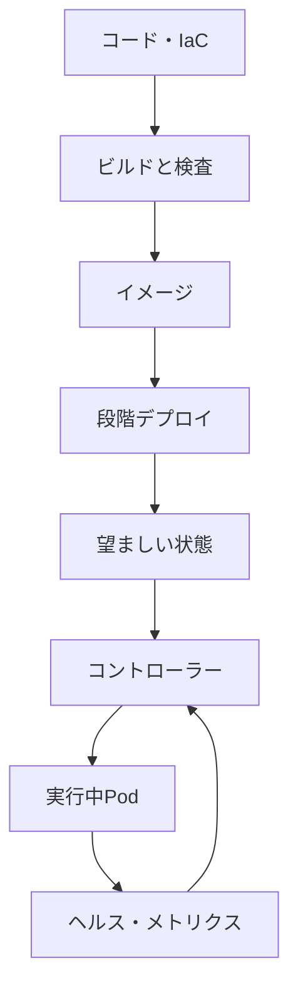

# インフラとクラウドネイティブ（Infrastructure & Cloud Native）

## 1. 一言でいうと

**クラウドネイティブなインフラとは、サーバーを手作業で維持するのではなく、望ましい状態を宣言し、自動化された制御で配置・復旧・拡縮・変更を繰り返せるようにする基盤です。**

コンテナはアプリと実行依存をまとめます。Kubernetesなどのオーケストレーターは複数の実行単位を望ましい数と状態へ近づけます。クラウドは計算、ネットワーク、ストレージ、IAMなどの資源をAPIで提供します。三つは役割が異なります。

## 2. なぜ必要なのか

ECサイトを一台の手作業サーバーで運用すると、環境差、属人的な変更、単一障害点、容量不足が起きやすくなります。一方、Kubernetesを導入するだけでは信頼性は得られません。誤ったヘルスチェックは正常なPodを再起動し、誤ったオートスケール指標は負荷に追いつけません。

基盤で解く問いは次です。

- 何を、どの設定とバージョンで実行するか
- 障害をどう検出し、どこへ再配置するか
- どれだけの資源を予約し、いつ増減するか
- 誰が何を変更できるか
- 変更をどう検証し、戻すか
- 利用量と費用を誰が観測するか

## 3. 仕組み



### 4.1 コンテナイメージ

イメージは実行物と依存を不変の単位にします。同じタグを上書きせず、ダイジェストや一意なバージョンで追跡します。秘密情報はイメージへ埋め込みません。

```dockerfile
FROM golang:1.25 AS build
WORKDIR /src
COPY go.mod go.sum ./
RUN go mod download
COPY . .
RUN CGO_ENABLED=0 go build -o /out/app ./cmd/api

FROM gcr.io/distroless/static-debian12:nonroot
COPY --from=build /out/app /app
USER nonroot:nonroot
ENTRYPOINT ["/app"]
```

期待結果は、ビルド道具やソースを実行イメージへ持ち込まず、非rootで同じバイナリを動かせることです。実際には依存の固定、SBOM、署名、脆弱性検査もCIへ組み込みます。

### 4.2 宣言と調整ループ

KubernetesではDeploymentが「このイメージのPodを3個」と宣言し、コントローラーが実状態との差を埋めます。Podを消しても代替は作られますが、アプリの論理不具合や失われたデータまで自動修復するわけではありません。

### 4.3 三つのprobe

| Probe | 答える問い | 失敗時 |
|---|---|---|
| startup | 起動が完了したか | 完了まで他のprobeを待たせる |
| readiness | 今、新規トラフィックを受けられるか | Serviceの送信先から外す |
| liveness | 再起動しなければ回復しないか | コンテナを再起動する |

DBが一時的に遅いだけでlivenessを失敗させると、全Podの再起動が障害を拡大します。外部依存の瞬間的な不調はreadinessやアプリの縮退で扱い、livenessはデッドロックなど再起動が有効な状態へ絞ります。

## 4. 具体例：注文APIを配置する

```yaml
apiVersion: apps/v1
kind: Deployment
metadata:
  name: order-api
spec:
  replicas: 3
  template:
    spec:
      containers:
        - name: api
          image: registry.example/order-api@sha256:abc123
          resources:
            requests: { cpu: 250m, memory: 256Mi }
            limits: { memory: 512Mi }
          readinessProbe:
            httpGet: { path: /ready, port: 8080 }
          livenessProbe:
            httpGet: { path: /live, port: 8080 }
```

前提は、`/ready` が新規注文を安全に受けられる状態、`/live` がプロセス内部の回復不能状態だけを返すことです。期待結果は、準備前や終了処理中のPodへ新規通信を送らず、停止したプロセスだけを再起動することです。

### オートスケールの流れ

1. 負荷試験で1 Podあたりの安全な処理量を測る。
2. CPUだけでなくRPS、キュー長、処理待ち時間など支配的な指標を選ぶ。
3. 起動時間とスケール速度を考え、急増には事前増強や受け入れ制御を併用する。
4. Podが増えてもDB接続数や外部API上限を超えないか確認する。
5. ノード容量も増やせるか、割り当て不能Podを監視する。

## 5. いつ使うか・使わないか

### オーケストレーターが向く

- 複数サービスを共通方式で配置・監視したい
- レプリカ、段階更新、自己修復を標準化したい
- 運用基盤を所有する能力と継続的な需要がある

### より単純なマネージド実行環境が向く

- サービス数とチームが小さい
- クラスタ運用が事業価値に直結しない
- リクエスト駆動やジョブ実行という標準モデルに収まる

クラウドネイティブはKubernetesを使うことと同義ではありません。API、自動化、再現性、観測性を、必要な運用負担で得られる手段を選びます。

## 6. 設計上の選択肢とトレードオフ

| 選択 | 強み | 代償 |
|---|---|---|
| VM | 制御範囲が広い | OS更新、配置、復旧の責任 |
| コンテナ基盤 | 配置の標準化、可搬性 | ネットワーク・制御面の複雑さ |
| サーバーレス | 実行基盤管理とアイドル費用を削減 | 起動遅延、制限、ロックイン |
| 水平スケール | 複数レプリカで負荷分散 | 状態外出し、依存先負荷 |
| 垂直スケール | アプリ変更が少ない | 上限、再起動、単一障害範囲 |
| マネージドサービス | 運用作業を委譲 | 費用、制約、移行難度 |

## 7. よくある失敗と運用上の注意

- **`latest` タグを使う**: 実行中の内容と切戻し先を特定できない。
- **requestsを設定しない**: スケジューリングと自動拡縮の基準が崩れる。
- **livenessを外部依存へ結ぶ**: 依存障害時に再起動の嵐を起こす。
- **Podだけ増やす**: DB、NAT、外部APIの上限を先に超える。
- **手作業で本番変更する**: 構成差と監査不能を生む。IaCとレビューを使う。
- **広いIAM権限**: ワークロードごとに最小権限と短命な資格情報を使う。
- **費用を月末だけ見る**: タグ、予算アラート、単位コスト、未使用資源を継続観測する。
- **バックアップ未復元**: 復元試験とRTO/RPO測定まで行う。

## 8. 第三者へ説明する

### 30秒で説明するなら

> クラウドネイティブなインフラは、望ましい実行状態を宣言し、自動制御で配置・復旧・拡縮・変更を再現可能にする基盤です。コンテナは実行単位、Kubernetesは調整、クラウドはAPI化された資源を担います。ヘルスチェック、資源要求、IAM、段階リリース、観測まで設計して初めて安全に運用できます。

### 3分で説明するなら

1. イメージとIaCを不変・版管理可能な成果物にする。
2. 宣言したレプリカ数と実状態の差をコントローラーが調整すると説明する。
3. startup、readiness、livenessを起動・受付・再起動の問いで分ける。
4. 実測した容量と依存先上限からrequestsとスケール指標を決める。
5. 最小権限、秘密管理、段階リリース、切戻しで変更リスクを抑える。
6. SLOと単位コストを観測し、復元・障害訓練で実効性を確かめる。

## 9. ケース問題・追加質問

### ケース問題

セール中にCPUが上がり、HPAがPodを10倍にしましたが、注文エラーが増えました。なぜでしょうか。

::: details 模範回答
Pod以外の制約を疑います。全PodのDB接続プール合計、決済APIのレート上限、ノード容量、起動完了前のトラフィック、キュー滞留を確認します。アプリ層を増やすほどDB接続や外部呼び出しが増え、下流を過負荷にした可能性があります。依存先の許容量から総同時実行数を制限し、受け入れ制御と事前増強も検討します。
:::

**Q. 自己修復なら障害対応は不要ですか？**

いいえ。コントローラーは宣言との差を直しますが、誤った宣言、アプリ不具合、データ破損、依存障害は別の検出と復旧が必要です。

**Q. コンテナならどの環境でも同じですか？**

アプリの実行物は揃えやすくなりますが、カーネル、CPU、ネットワーク、ストレージ、権限、設定の差は残ります。

## 10. まとめ

- コンテナ、オーケストレーター、クラウドは異なる役割を持つ。
- 宣言と調整ループで配置・復旧を再現可能にする。
- probeは起動、受付可能性、再起動必要性の問いで分ける。
- オートスケールは依存先上限、起動時間、ノード容量まで設計する。
- IaC、最小権限、段階リリース、復元試験、コスト観測を運用に含める。

## 11. 参考資料

- [Kubernetes Documentation: Self-Healing](https://kubernetes.io/docs/concepts/architecture/self-healing/)
- [Kubernetes Documentation: Liveness, Readiness, and Startup Probes](https://kubernetes.io/docs/concepts/configuration/liveness-readiness-startup-probes/)
- [Kubernetes Documentation: Autoscaling Workloads](https://kubernetes.io/docs/concepts/workloads/autoscaling/)
- [Docker Documentation: Multi-stage builds](https://docs.docker.com/build/building/multi-stage/)
- [AWS Well-Architected Framework](https://docs.aws.amazon.com/wellarchitected/latest/framework/welcome.html)
