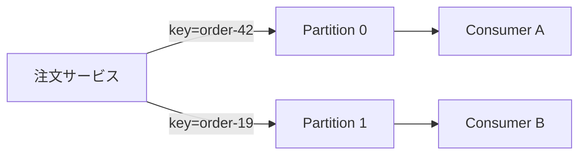
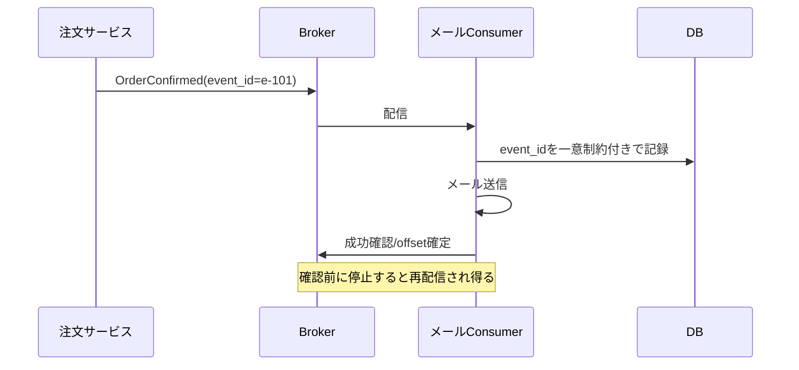

# メッセージングとイベントストリーミング（Messaging & Event Streaming）

## 1. 一言でいうと

**メッセージングとは、送信側と受信側が同時に動かなくても仕事や事実を受け渡せる仕組みであり、時間的な疎結合と引き換えに重複、順序、遅延、追跡を扱う設計です。**

「注文確定」を同期HTTPで通知すると、メールサービスの障害が注文APIへ影響します。メッセージを耐久的に保存して後から処理すれば分離できますが、受信確認直前のクラッシュなどにより同じメッセージが再配信され得ます。

## 2. なぜ必要なのか

- 重い処理を利用者の応答経路から外したい
- 一時的な障害や負荷差をキューで吸収したい
- 一つの業務イベントを複数の利用者へ届けたい
- イベント履歴を再生し、新しい派生データを作りたい

一方、即時結果が必要な問い合わせや強いトランザクション整合性には同期呼び出しの方が単純です。非同期化は失敗を消さず、後で扱う形へ変えます。

## 3. 仕組み

### 4.1 キューとイベントログ

| 方式 | 読み方 | 主な用途 |
|---|---|---|
| ワークキュー | 通常、同じ処理グループの一つの受信者が担当 | メール送信、画像変換、ジョブ分散 |
| Pub/Sub | 購読者ごとに配信 | 複数機能への通知 |
| イベントログ | 順序付きログを位置（offset）から読む | 再生、分析、状態変更の配信 |

Kafkaではトピックをパーティションへ分けます。同じキーを同じパーティションへ送れば、そのパーティション内の書き込み順で読めます。トピック全体や異なるキー間の順序は保証されません。



パーティションは並列度の単位でもあります。同一コンシューマーグループでは、通常一つのパーティションを同時に担当するコンシューマーは一つです。

### 4.2 配信保証

- **At-most-once**: 欠落する可能性はあるが、再配信を避ける
- **At-least-once**: 欠落を避けるため再配信し、重複を許容する
- **Exactly-once**: 定義された境界内で結果を一度だけ反映する保証

「Exactly-once」は製品名だけでエンドツーエンドに成立しません。DB更新、外部API、オフセット確定を含む境界と前提を確認します。一般的にはat-least-onceと冪等な受信処理を組み合わせます。

## 4. 具体例：注文確定後にメールを送る



```sql
-- 前提: event_id は発行元が再試行しても変えない。
BEGIN;
INSERT INTO consumed_events (consumer, event_id)
VALUES ('order-mailer', 'e-101')
ON CONFLICT DO NOTHING;
-- 挿入できた場合だけ送信予定を作成する。
INSERT INTO email_jobs (event_id, template)
SELECT 'e-101', 'order-confirmed'
WHERE EXISTS (
  SELECT 1 FROM consumed_events
  WHERE consumer = 'order-mailer' AND event_id = 'e-101'
);
COMMIT;
-- 期待結果: 再配信されても同じ送信予定を重複作成しない。
```

実装では「今回挿入したか」を戻り値で判定します。メール送信自体が外部副作用なら、送信ジョブにも冪等キーを渡すか、重複許容の方針を決めます。

## 5. いつ使うか・使わないか

### 向く場合

- 利用者が後続処理の完了を待つ必要がない
- 生産側と消費側の一時的な速度差を吸収したい
- 同じイベントを複数の独立した用途で利用する
- 履歴の再生や監査が必要である

### 向かない場合

- 呼び出し元がその場で結果を必要とする
- 一つのDBトランザクションで単純に完結する
- 遅延や結果整合性を業務が受け入れられない
- ブローカー、スキーマ、ラグ、DLQを運用できない

## 6. 設計上の選択肢とトレードオフ

| 判断軸 | 選択肢と代償 |
|---|---|
| ペイロード | 薄いイベントは小さいが再問い合わせが必要。太いイベントは自己完結するが個人情報と契約が増える |
| 順序 | キー単位の順序は保ちやすいが、偏ったキーはホットパーティションになる |
| 確認時点 | 処理前なら欠落、処理後なら重複の可能性が増える |
| 再試行 | 回復しやすいが下流障害を増幅し得る |
| 保持 | 長いほど再生できるが容量・削除要件への対応が必要 |

イベントには安定した`event_id`、種類、発生時刻、スキーマ版、集約IDを持たせます。互換性のある変更を基本とし、破壊的変更は新しい種類や版として扱います。

## 7. よくある失敗と運用上の注意

### 無制限の即時再試行

永続的な入力エラーや下流障害に再試行すると、処理能力を使い切ります。指数バックオフ、ジッター、最大回数を設け、回復不能なメッセージをDLQへ隔離します。DLQは墓場ではなく、原因、所有者、再投入手順、保持期限を管理します。

### オフセットを早く確定する

処理前の確定はクラッシュ時に欠落を招きます。処理後の確定は重複を招き得るため、受信処理を冪等にします。

### ラグの件数だけを見る

件数が同じでもイベント頻度は変わります。最古メッセージの年齢、処理率、失敗率、パーティション別ラグ、再試行・DLQ数を監視します。生産速度が処理速度を超えるときは、受信停止や流量制限でバックプレッシャーを伝えます。

## 8. 第三者へ説明する

### 30秒で説明するなら

> メッセージングは送信側と受信側を時間的に分離し、負荷差や一時障害を吸収する仕組みです。その代わり再配信による重複、パーティション単位の順序、処理遅延を扱う必要があります。安定したイベントID、冪等な受信処理、上限付き再試行、DLQ、ラグ監視をセットで設計します。

### 3分で説明するなら

1. 同期呼び出しと非同期メッセージの違いを示す。
2. キュー、Pub/Sub、イベントログの用途を分ける。
3. Kafkaの順序はパーティション内だけだと説明する。
4. 確認直前の障害で重複し得るため冪等性が必要だと示す。
5. 再試行、DLQ、バックプレッシャー、観測まで含めて運用すると結ぶ。

## 9. ケース問題・追加質問

### ケース問題

同じ`OrderConfirmed`を受けて、顧客へ確認メールが2通送られました。ブローカーの障害でしょうか。

::: details 模範回答
必ずしも障害ではありません。at-least-once配信では、処理後・確認前のクラッシュなどで再配信が起きます。配信IDだけでなく業務上の冪等キーを保存し、同じ注文・テンプレートの送信予定を一意にします。いつ確認を確定したか、再配信数、受信側ログを調べます。
:::

### よくある追加質問

**Q. KafkaならExactly-onceですか？**

Kafkaのトランザクション機能が保証する境界と構成があります。任意の外部DBやメール送信まで自動で一度だけになるわけではありません。

**Q. DLQへ入れれば解決ですか？**

いいえ。業務処理は未完了です。通知、調査、修正、再投入または破棄の判断が必要です。

## 10. まとめ

- 非同期化は時間的な疎結合を得る代わりに遅延と運用を増やす。
- キューとイベントログは読み方と保持の考え方が異なる。
- 順序保証の範囲と配信保証の境界を確認する。
- at-least-onceでは冪等な受信処理を基本にする。
- 再試行、DLQ、ラグ、バックプレッシャーまで設計する。

## 11. 参考資料

- [Apache Kafka Documentation: Introduction](https://kafka.apache.org/documentation/#intro_concepts_and_terms)
- [Apache Kafka Documentation: Message Delivery Semantics](https://kafka.apache.org/documentation/#semantics)
- [Amazon SQS Developer Guide: Visibility timeout](https://docs.aws.amazon.com/AWSSimpleQueueService/latest/SQSDeveloperGuide/sqs-visibility-timeout.html)
- [CloudEvents Specification](https://github.com/cloudevents/spec/blob/main/cloudevents/spec.md)
- [Reactive Streams Specification](https://www.reactive-streams.org/)
