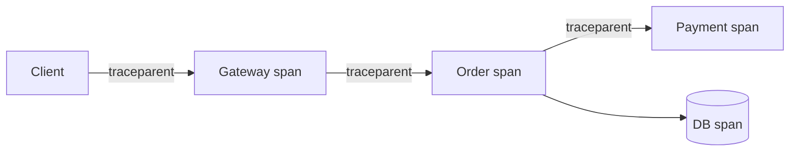

# オブザーバビリティ（Observability）

## 1. 一言でいうと

**オブザーバビリティとは、システムが出す情報から、事前に想定していなかった問題を含めて内部状態を調べられる性質です。**

ログ、メトリクス、トレースを保存すること自体が目的ではありません。「購入成功率が落ちたのはなぜか」という問いから、影響範囲、遅い箇所、該当イベントへ辿れることが重要です。

## 2. なぜ必要なのか

分散したECサイトでは、画面のタイムアウト原因がAPI、決済、DB、ネットワークのどこにあるか外からは分かりません。再現できない一部利用者だけの障害もあります。観測情報が不足すると、推測で再起動し、原因と影響を確認できません。

オブザーバビリティは、障害検知、原因調査、容量計画、変更の効果確認を同じデータで支えます。

## 3. 仕組み

### 4.1 三つの代表的なシグナル

| シグナル | 得意な問い | 例 |
|---|---|---|
| メトリクス | いつから、どの程度、誰に影響したか | RPS、エラー率、P99、キュー長 |
| トレース | 1要求のどの区間が遅い・失敗したか | API→注文→決済のspan |
| ログ | その地点で何が起きたか | 状態遷移、例外、注文ID |

これらは「三本柱を全部集めれば完成」という意味ではありません。必要な問い、費用、機密性から計装と保持期間を決めます。

### 4.2 Context Propagation



W3C Trace Contextの `traceparent` はtrace ID、親span ID、フラグなどをサービス間で伝えます。各サービスが子spanを作ることで一つの処理経路を復元できます。外部入力のtrace IDを無条件に信頼せず、形式検証とサンプリング方針を適用します。

### 4.3 SLI、SLO、エラー予算

- **SLI**: 利用者から見た良さの測定値。例は「有効な注文要求のうち正しく完了した割合」。
- **SLO**: SLIの目標。例は「直近28日で99.9%以上」。
- **エラー予算**: SLOが許容する不足分。100%を目標にするのではなく、変更速度との判断に使う。
- **SLA**: 提供者と顧客の契約。SLOと同じとは限らない。

## 4. 具体例：購入失敗を調査する

```json
{
  "timestamp": "2026-08-23T10:15:30Z",
  "severity": "ERROR",
  "service.name": "order-api",
  "trace_id": "4bf92f3577b34da6a3ce929d0e0e4736",
  "order_id": "o-5521",
  "event": "payment_timeout",
  "duration_ms": 1200,
  "retry_count": 1
}
```

前提は、注文APIから決済APIへtrace contextを伝播していることです。入力は「10:15から購入成功率が低下」というアラートです。期待する調査結果は次の流れです。

1. 成功率とP99を地域・APIバージョン別に絞る。
2. 失敗時間帯の代表traceから決済spanの遅延を見つける。
3. 同じtrace IDの構造化ログでタイムアウトと再試行を確認する。
4. デプロイや設定変更のイベントと重ねる。

ログにアクセストークン、カード情報、不要な個人情報を含めません。

## 5. いつ使うか・使わないか

本番サービス、非同期処理、外部依存、複数サービスでは設計初期から必要です。小さな単一プロセスでも、リクエスト数、失敗、遅延、構造化ログから始める価値があります。

すべての関数をtrace化したり、全ログを永久保存したりしません。高カーディナリティ属性、保存費用、調査価値、個人情報リスクを比較し、サンプリングと保持を決めます。

## 6. 設計上の選択肢とトレードオフ

| 選択 | 利点 | 代償 |
|---|---|---|
| 全trace保存 | 稀な問題も残る | 費用と転送負荷 |
| ヘッドサンプリング | 早く量を削減 | 後から失敗を選べない |
| テールサンプリング | エラー・遅いtraceを残せる | Collectorの遅延と状態 |
| 詳細ログ | 文脈が豊富 | 費用、漏えい、ノイズ |
| 高カーディナリティ属性 | 細かな絞り込み | メトリクス基盤の負荷 |

メトリクスのラベルへuser IDやorder IDを直接入れると系列数が爆発します。個別IDはログやtraceへ置きます。

## 7. よくある失敗と運用上の注意

### インフラ使用率だけで警報する

CPU高騰が利用者影響を伴わない場合も、CPU正常で注文が失敗する場合もあります。成功率と遅延を中心にします。

### アラートが多すぎる

行動のない警告は無視されます。影響、担当、runbook、緊急度を明確にし、重複をまとめます。

### traceが途中で切れる

HTTPだけでなく、メッセージキューや非同期ジョブにもcontextを伝えます。境界ごとの伝播テストを用意します。

### 収集基盤の障害で本体を止める

テレメトリ送信は有界バッファと非同期化を使い、過負荷時にアプリケーション本体へ波及させません。

## 8. 第三者へ説明する

### 30秒で説明するなら

> オブザーバビリティは、外部へ出した情報からシステム内部で何が起きたかを調べられる性質です。メトリクスで影響を見つけ、トレースで遅い区間を特定し、ログで出来事の文脈を確認します。SLIとSLOを利用者視点で決め、行動につながるアラートを作ります。

### 3分で説明するなら

1. データ収集ではなく、未知の問いへ答えられる性質だと定義する。
2. 購入成功率の低下をメトリクスで検知する。
3. trace contextで注文から決済までを追い、遅いspanを見つける。
4. 同じtrace IDのログで状態と例外を確認する。
5. SLO、費用、個人情報を踏まえて計装を継続改善すると結ぶ。

## 9. ケース問題・追加質問

### ケース問題

「APIのCPUは正常だが、一部利用者だけ購入が遅い」と報告されました。どう調べますか。

::: details 模範回答
購入レイテンシを地域、バージョン、依存先などの低〜中カーディナリティ属性で分けます。遅いtraceを抽出し、各spanの所要時間とエラーを比較します。trace IDから注文ログを検索し、該当利用者の機密情報を露出せず状態遷移を確認します。CPU正常だけでアプリケーション正常とは判断しません。
:::

### よくある追加質問

**Q. ログがあればtraceは不要ですか？**

サービス間の親子関係と区間時間をログだけで復元するのは難しい場合があります。目的に応じて相互参照します。

**Q. P99だけをアラートにすべきですか？**

低トラフィックでは不安定になることがあります。成功率、影響件数、時間窓と組み合わせます。

**Q. OpenTelemetryは保存・可視化製品ですか？**

主にテレメトリのAPI、SDK、計装、収集、伝送を標準化する仕組みであり、観測バックエンドそのものではありません。

## 10. まとめ

- オブザーバビリティは未知の問題を外部情報から調べられる性質である。
- メトリクス、トレース、ログは異なる問いに答え、IDで関連づける。
- 利用者視点のSLI/SLOから計装とアラートを設計する。
- カーディナリティ、費用、機密性、収集障害を管理する。
- 障害調査で得た不足を計装へ戻し、継続改善する。

## 11. 参考資料

- [OpenTelemetry: Observability primer](https://opentelemetry.io/docs/concepts/observability-primer/)
- [OpenTelemetry: Signals](https://opentelemetry.io/docs/concepts/signals/)
- [OpenTelemetry: What is OpenTelemetry?](https://opentelemetry.io/docs/what-is-opentelemetry/)
- [W3C Recommendation: Trace Context](https://www.w3.org/TR/trace-context/)
- [Google SRE Workbook: Implementing SLOs](https://sre.google/workbook/implementing-slos/)
