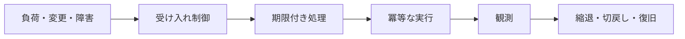
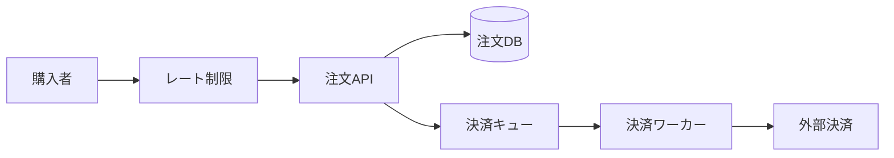

# 本番環境を前提に考える（Production Thinking）

## 1. 一言でいうと

**本番思考とは、入力・負荷・依存先・変更が予想どおりにならないことを前提に、影響を限定し、観測し、復旧できるよう設計する姿勢です。**

本番では「サーバーが動くか」だけでなく、混雑時にどう劣化するか、途中まで成功した処理をどう扱うか、誰が異常に気づくかまでが機能の一部です。

## 2. なぜ必要なのか

ECサイトのローカル試験では、依存先は速く、データ量は少なく、操作も一度ずつです。本番では次が同時に起こります。

- セール開始にアクセスが集中する
- 決済APIが遅いが完全停止はしていない
- 利用者やプロキシがタイムアウト後に同じ注文を再送する
- 新旧バージョンが段階配信中に混在する
- ログ、時刻、設定、権限が環境ごとに違う

これらは例外ではなく、規模が増えれば必ず遭遇する通常の条件です。

## 3. 仕組み：壊れ方を制御する



### 4.1 期限と再試行

タイムアウトがなければ、遅い依存先が接続やスレッドを占有します。再試行は一時障害を隠せますが、負荷を増幅します。

安全な再試行には次が必要です。

- 呼び出し全体の期限を先に決める
- 指数バックオフとランダムなジッターを使う
- 再試行回数を制限する
- その操作が冪等であるか確認する
- 429や明示的な再試行可能エラーだけを対象にする

### 4.2 冪等性

同じ要求が複数回来ても、望ましい効果が一度だけ現れる性質です。注文APIではクライアントが一意なキーを送り、サーバーが結果と対応づけます。

```sql
-- 前提: idempotency_key に一意制約がある
INSERT INTO orders (idempotency_key, customer_id, status)
VALUES ('01J-ORDER-1', 'C1', 'pending')
ON CONFLICT (idempotency_key) DO NOTHING;
```

入力が同じキーなら、期待結果は新しい注文を増やさず、最初の注文結果を返すことです。DB更新と外部決済をまたぐ場合は、状態遷移や決済事業者側の冪等キーも必要です。

### 4.3 過負荷を押し返す

キューを無制限に伸ばすと、障害を遅延へ変えただけになります。受け入れ上限、同時実行数、レート制限、キュー長の上限を決め、重要度の低い機能から縮退します。

## 4. 具体例：セール開始時の注文



1. 商品推薦や閲覧履歴を停止し、注文経路へ容量を残す。
2. 注文APIは冪等キーで重複を防ぎ、短時間で受付状態を返す。
3. ワーカーの同時実行数を決済APIの許容量以下に制限する。
4. 決済遅延時はキュー滞留時間を監視し、受付制限か縮退を行う。
5. 結果が不明な決済は自動で成功・失敗と決めつけず、照会して収束させる。

「すべて成功させる」だけでなく、どの機能を守り、どれを止めるかを事前に決めます。

## 5. いつ使うか・使わないか

本番思考はすべての外部公開処理に必要ですが、対策の強さはリスクに合わせます。

- 注文・決済: 冪等性、監査記録、状態機械、手動復旧手順まで用意する
- 商品検索: 古いキャッシュや簡易結果への縮退を許容できる
- メール通知: 遅延と重複を許し、キューで再処理できる
- 社内バッチ: 実行時間帯、再開地点、二重実行の影響を決める

単純な読み取りへ複雑な分散ロックを加えるなど、損害に見合わない対策は避けます。

## 6. 設計上の選択肢とトレードオフ

| 対策 | 守れるもの | 新たな注意点 |
|---|---|---|
| タイムアウト | リソース占有時間 | 短すぎると正常処理を中断 |
| 再試行 | 一時障害 | 負荷増幅、重複 |
| サーキットブレーカー | 障害依存先からの隔離 | 復帰判定、状態管理 |
| キュー | 負荷平準化、非同期再処理 | 遅延、重複、滞留上限 |
| レート制限 | 容量保護、公平性 | 正常利用者の拒否 |
| 段階リリース | 変更の影響範囲 | 新旧互換、判定指標 |

## 7. よくある失敗と運用上の注意

- **タイムアウトなし**: 遅延が接続枯渇と連鎖障害になる。
- **即時・無制限の再試行**: 障害中の依存先へ追加負荷をかける。
- **非冪等なPOSTを再試行**: 二重注文や二重請求を生む。
- **キューを無限バッファと考える**: 回復不能な遅延と容量超過になる。
- **平均値だけを監視**: p95/p99、エラー率、滞留時間、飽和を見る。
- **一斉リリース**: 小さな不具合を全利用者へ広げる。
- **手順の未演習**: バックアップや切戻しは実際に試して初めて能力になる。

アラートには、利用者影響、確認先、最初の安全な操作、担当を含むランブックを結びつけます。

## 8. 第三者へ説明する

### 30秒で説明するなら

> 本番思考は、高負荷、部分障害、重複要求、設定差、変更事故が起きる前提で、影響を限定して復旧できるようにする考え方です。タイムアウトと制限付き再試行、冪等性、受け入れ制御、段階リリース、観測を組み合わせ、重要機能を守りながら安全に劣化させます。

### 3分で説明するなら

1. 重要な利用者動線と許容できない損害を決める。
2. 依存先の遅延・停止と重複要求を前提にする。
3. 期限、制限付き再試行、冪等キーで資源と副作用を守る。
4. レート制限とキュー上限で過負荷を押し返す。
5. 段階リリースとSLO指標で変更の影響を小さく検出する。
6. 縮退、切戻し、データ修復を演習して復旧可能性を確かめる。

## 9. ケース問題・追加質問

### ケース問題

決済APIが10秒でタイムアウトしました。利用者が再度購入ボタンを押しました。単純にもう一度決済してよいでしょうか。

::: details 模範回答
いけません。最初の決済が外部では成功し、応答だけ失われた可能性があります。同じ注文・決済に同じ冪等キーを使い、保存した処理状態と決済事業者への照会で結果を確定します。再試行には回数と期限を設け、不明状態が残れば自動再請求せず、照合・手動対応へ送ります。
:::

**Q. フェイルファストは常に正しいですか？**

重要でない処理を早く拒否して容量を守る場合には有効です。一方、注文のように受付事実を失えない処理では、耐久キューや状態保存と組み合わせます。

**Q. 自動復旧があれば当番は不要ですか？**

自動化が対処できない未知の障害は残ります。自動化の失敗を検知し、人が安全に介入できる手順と権限が必要です。

## 10. まとめ

- 本番では部分障害、過負荷、重複、変更の混在が通常状態である。
- タイムアウトと再試行は、期限・バックオフ・冪等性と一緒に設計する。
- 容量を超えた仕事は、無制限にためず受け入れを制御する。
- 重要度に応じて縮退し、変更は小さく配って素早く戻す。
- 検出・復旧・データ修復を実際に演習する。

## 11. 参考資料

- [Google SRE Book: Addressing Cascading Failures](https://sre.google/sre-book/addressing-cascading-failures/)
- [Google SRE Book: Handling Overload](https://sre.google/sre-book/handling-overload/)
- [Google SRE Book: Release Engineering](https://sre.google/sre-book/release-engineering/)
- [AWS Builders' Library: Timeouts, retries, and backoff with jitter](https://aws.amazon.com/builders-library/timeouts-retries-and-backoff-with-jitter/)
