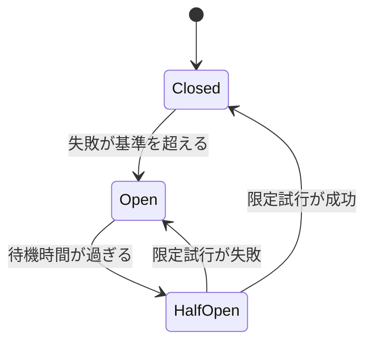

# 信頼性と耐障害性（Reliability & Fault Tolerance）

## 1. 一言でいうと

**信頼性とは、利用者が期待する機能を決めた期間にわたり正しく提供できる性質であり、耐障害性は一部が故障してもその提供を続ける能力です。**

「サーバーが起動している」だけでは十分ではありません。注文APIが200を返しても注文が保存されないなら信頼できません。何をどの程度守るかをSLOで定義します。

## 2. なぜ必要なのか

ネットワーク遅延、プロセス停止、ディスク故障、設定ミス、依存サービス障害は避けきれません。重要なのは、故障をゼロにすることではなく、局所故障を全体停止にしないこと、利用者に誤った成功を返さないこと、定めた時間内に復旧することです。

ECサイトなら商品推薦は縮退できますが、二重決済や注文消失は許容しにくいものです。機能ごとに重要度と整合性を分けます。

## 3. 仕組み

### 4.1 呼び出しを有限にする

- **タイムアウト**: いつまで待つかを決め、資源を解放する。
- **再試行**: 一時的な失敗をやり直す。安全な操作か、冪等キーがある場合に限定する。
- **指数バックオフとジッター**: 試行間隔を広げ、同時再試行を分散する。
- **再試行予算**: 通常トラフィックに対して追加試行の総量を制限する。

各試行のタイムアウトだけでなく、利用者から見た全体期限を持ちます。

### 4.2 障害を隔離する



サーキットブレーカーは失敗し続ける依存先への呼び出しを一時的に遮断します。バルクヘッドは、決済用と推薦用の接続・スレッド・キューを分け、一方の枯渇を他方へ波及させません。

### 4.3 許容量を守り、縮退する

レート制限は処理能力を超える要求を入口で拒否・遅延させます。Token Bucketは一定速度でトークンを補充し、容量内の短いバーストを許容できます。縮退では、推薦を非表示にする、古い商品一覧を返すなど、中心機能を守るため品質や周辺機能を落とします。

### 4.4 復旧を設計する

- **RTO（Recovery Time Objective）**: 何時間以内に復旧するか。
- **RPO（Recovery Point Objective）**: 何分前までのデータ損失を許容するか。
- **フェイルオーバー**: 待機系へ処理を切り替える。
- **バックアップ/復元**: 削除や破損を過去のコピーから戻す。

レプリカは誤削除も複製するため、バックアップの代わりではありません。

## 4. 具体例：決済サービスの一時障害

注文APIが決済APIを同期呼び出しし、決済側が一時的に503を返すとします。

```python
# 前提: charge() は同じ idempotency_key の二重課金を防ぐ
# 入力: order_id="o-123"、全体期限2秒
# 期待結果: 一時失敗だけ最大3回試し、期限後は「決済処理中」とする
def pay(order_id, deadline):
    delays = [0.05, 0.12]  # 実際はランダムなジッターを加える
    for attempt in range(3):
        try:
            return charge(order_id, idempotency_key=order_id, deadline=deadline)
        except TemporaryError:
            if attempt == 2 or deadline.expired():
                return mark_payment_pending(order_id)
            sleep(delays[attempt])
```

再試行対象をタイムアウトや503などの一時障害に絞ります。入力不正の400や権限不足の403を繰り返しても回復しません。処理結果が不明なタイムアウトでは、同じ冪等キーで状態を照会・再実行できるようにします。

## 5. いつ使うか・使わないか

ネットワーク越しの呼び出しには期限が必要です。再試行は一時的で回復可能な失敗、サーキットブレーカーは依存先障害が資源枯渇へ波及する場面、バルクヘッドは重要度の違う仕事が資源を共有する場面に向きます。

永続的なエラーや非冪等操作を機械的に再試行しません。単一プロセス内の単純な関数へサーキットブレーカーを入れても、複雑さに見合う隔離効果は得にくいでしょう。

## 6. 設計上の選択肢とトレードオフ

| 選択 | 利点 | 代償・注意 |
|---|---|---|
| 短いタイムアウト | 資源を早く解放 | 正常な遅い処理も中断 |
| 再試行 | 一時障害を隠蔽 | 負荷増加、重複 |
| サーキットブレーカー | 連鎖障害を抑制 | 閾値と回復判定が必要 |
| バルクヘッド | 重要機能を隔離 | 未使用資源を融通しにくい |
| 縮退 | 中心機能を継続 | 鮮度・機能が低下 |
| 複数リージョン | 大規模障害へ備える | データ整合性、費用、訓練 |

## 7. よくある失敗と運用上の注意

### 再試行を成功率向上の万能策にする

過負荷への再試行は障害を増幅します。回数、対象エラー、全体期限、同時数を制限します。

### フォールバックが誤情報を返す

在庫や価格へ古い値を返すと損害になり得ます。縮退可能なデータと、失敗として止める処理を区別します。

### フェイルオーバーを試さない

DNS、権限、手順、データ遅延の問題は本番切替時に発覚します。定期演習と復元テストでRTO/RPOを実測します。

### 可用性だけを測る

成功率に加え、正しい注文、二重処理、遅延、データ鮮度など利用者が期待する結果をSLIにします。

## 8. 第三者へ説明する

### 30秒で説明するなら

> 信頼性は、利用者が期待する機能を正しく継続提供する性質です。障害は避けきれないため、タイムアウトと制限付き再試行、サーキットブレーカー、資源分離、縮退で影響を閉じ込めます。さらにRTOとRPOを決め、バックアップから実際に復元できることまで確認します。

### 3分で説明するなら

1. 稼働していることではなく、期待結果をSLO内で提供することだと定義する。
2. 決済タイムアウトを例に、期限、冪等性、制限付き再試行を説明する。
3. 遮断とバルクヘッドで依存先障害の波及を止める。
4. 推薦は縮退できても決済は誤成功にできないと重要度を分ける。
5. RTO/RPO、復元訓練、障害データで改善すると結ぶ。

## 9. ケース問題・追加質問

### ケース問題

商品推薦APIの遅延で購入画面全体がタイムアウトしています。どう改善しますか。

::: details 模範回答
推薦呼び出しへ購入画面全体より短い期限を設定し、専用の接続・同時実行枠へ隔離します。失敗時は推薦欄を非表示にするか安全な静的ランキングへ縮退します。失敗率が続くならサーキットブレーカーで遮断します。購入本体のSLOと推薦のSLOを分けて監視します。
:::

### よくある追加質問

**Q. 可用性99.9%なら信頼できますか？**

それだけでは判断できません。計測窓、対象リクエスト、遅延条件、正しさを含むSLIの定義が必要です。

**Q. 冪等性があれば何度でも再試行できますか？**

重複結果は防げても、依存先への負荷は増えます。期限と予算は依然必要です。

**Q. レプリカがあればバックアップ不要ですか？**

不要にはなりません。誤削除、破損、攻撃が複製されるため、独立した世代バックアップと復元確認が必要です。

## 10. まとめ

- 信頼性は利用者が期待する正しい結果を継続する性質である。
- 期限、冪等性、制限付き再試行を一組で設計する。
- 遮断、隔離、負荷制限、縮退で局所障害の波及を防ぐ。
- フェイルオーバーとバックアップは守る障害が異なる。
- SLO、RTO、RPOを定義し、演習で実効性を確かめる。

## 11. 参考資料

- [AWS Builders' Library: Timeouts, retries, and backoff with jitter](https://aws.amazon.com/builders-library/timeouts-retries-and-backoff-with-jitter/)
- [AWS Well-Architected Framework: Reliability Pillar](https://docs.aws.amazon.com/wellarchitected/latest/reliability-pillar/welcome.html)
- [Microsoft Azure Architecture Center: Circuit Breaker pattern](https://learn.microsoft.com/en-us/azure/architecture/patterns/circuit-breaker)
- [Microsoft Azure Architecture Center: Bulkhead pattern](https://learn.microsoft.com/en-us/azure/architecture/patterns/bulkhead)
- [NIST SP 800-34 Rev. 1: Contingency Planning Guide](https://csrc.nist.gov/pubs/sp/800/34/r1/final)
