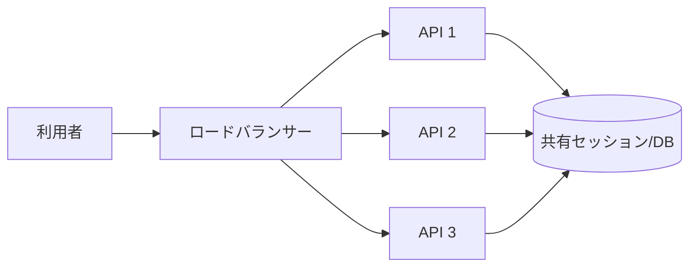

# スケーラビリティ（Scalability）

## 1. 一言でいうと

**スケーラビリティとは、リクエスト数やデータ量が増えたとき、リソースを追加して必要な性能を保てる性質です。**

性能は現在の速さ、スケーラビリティは負荷を増やしたときの変化の仕方です。1台では速くても、共有ロックや単一DBが限界なら台数を増やしても伸びません。「何台まで増やせるか」だけでなく、負荷、性能、コストの関係を測ります。

## 2. なぜ必要なのか

ECサイトでは、通常日の10倍のアクセスがセール開始時に集中することがあります。設計に余地がないと、商品閲覧の増加だけで購入処理まで遅くなります。一方、最大負荷に合わせて常時大きなサーバーを置けば費用が無駄になります。

スケーラビリティ設計は次を両立させるために必要です。

- 需要増加時にもSLOを守る
- 一部の機能だけを必要な分だけ増強する
- 負荷低下時には余分なリソースを減らす
- 成長段階に応じて、複雑さとコストを段階的に増やす

## 3. 仕組み

### 4.1 垂直スケールと水平スケール

| 方法 | 何を増やすか | 強み | 限界 |
|---|---|---|---|
| 垂直スケール | 1台のCPU、メモリ、I/O性能 | 構成変更が少なく、整合性を保ちやすい | 機種上限、停止を伴う変更、故障点の集中 |
| 水平スケール | 同じ役割のインスタンス数 | 段階的な増減、冗長化、個別交換 | 分散状態、通信、負荷偏り、運用の複雑さ |

水平スケールにも上限があります。DB接続、共有ロック、ネットワーク帯域などが先に飽和すれば、アプリケーションを増やすほど競合が悪化します。

### 4.2 ステートレス化とロードバランシング

アプリケーションのメモリにログイン状態を固定せず、署名済みCookieや共有セッションストアへ置くと、どのインスタンスでも次のリクエストを処理できます。



ただし状態を外へ移しただけなら、共有ストアが新たなボトルネックになります。容量、レイテンシ、接続数、障害時の挙動も設計対象です。

### 4.3 データ層を広げる

- **リードレプリカ**: 読み取りを複製先へ逃がす。非同期複製では反映遅延があり、更新直後の値が見えない場合がある。
- **パーティショニング**: 一つのDB内で大きな表を範囲やキーで分け、検索・保守対象を絞る。
- **シャーディング**: データを複数のDBへ分散し、書き込み容量も広げる。跨ぐ問い合わせや再配置は複雑になる。

同じ単語が製品によって異なる意味で使われるため、「データをどの単位へ、誰が振り分けるか」まで確認します。

## 4. 具体例：セール中のECサイト

通常100 RPS、セール時1,500 RPSの商品閲覧APIを考えます。注文APIは100 RPS程度です。

1. 負荷試験で、商品APIのCPUが先に飽和すると確認する。
2. APIをステートレスにし、商品APIだけ水平スケールする。
3. 商品詳細をキャッシュし、DB読み取りを減らす。
4. 更新直後の一貫性が必須でない一覧はリードレプリカへ送る。
5. 人気商品1件へアクセスが集中するなら、そのキーを複製・事前計算する。

```yaml
# 前提: Kubernetes Metrics APIが利用でき、各PodにCPU requestが設定済み
# 入力: 商品APIの平均CPU使用率
# 期待結果: 60%を目標に2〜20 Podの範囲で定期的に調整される
apiVersion: autoscaling/v2
kind: HorizontalPodAutoscaler
metadata:
  name: catalog-api
spec:
  minReplicas: 2
  maxReplicas: 20
  scaleTargetRef:
    apiVersion: apps/v1
    kind: Deployment
    name: catalog-api
  metrics:
    - type: Resource
      resource:
        name: cpu
        target:
          type: Utilization
          averageUtilization: 60
```

CPUは原因ではなく結果の場合もあります。待ち行列長や処理可能件数など、需要を早く表す指標も候補にします。

## 5. いつ使うか・使わないか

### まず垂直スケールが向く場合

- 現在の上限まで十分な余裕があり、運用を単純に保ちたい
- DBのように状態と整合性の分散が難しい
- 短期的な容量不足を低リスクで解消したい

### 水平スケールを検討する場合

- 負荷が変動し、段階的な増減に価値がある
- 処理を独立した単位へ分けられる
- 単一インスタンスの上限や障害点を避けたい

負荷が小さく一定なら、オートスケールやシャーディングを先に導入しません。測定、運用、障害モードの増加が便益を上回るためです。

## 6. 設計上の選択肢とトレードオフ

| 選択 | 得られるもの | 支払う代償 |
|---|---|---|
| ステートレスAPI | 任意インスタンスへの配送 | 外部状態ストアへの依存 |
| リードレプリカ | 読み取り容量、冗長性 | 複製遅延、読取先の制御 |
| キャッシュ | 低遅延、DB負荷削減 | 失効、古い値、ホットキー |
| シャーディング | 書込・保存容量の分散 | 跨ぎ処理、再配置、整合性 |
| オートスケール | 需要への追従、費用調整 | 起動遅延、揺れ、指標選定 |

選択前に、ピークRPS、データ増加率、P95/P99、エラー率、飽和指標、1リクエスト当たり費用を基準値として残します。

## 7. よくある失敗と運用上の注意

### 「水平スケールは無限」と考える

共有DB、外部API、帯域、ロックが上限になります。依存先ごとの利用量と待ち時間を測ります。

### 平均負荷だけで増減する

平均CPUが低くても、一部パーティションだけが飽和していることがあります。キー別・シャード別の偏りも確認します。

### 起動時間を無視する

Podの起動に2分かかるなら、急増後のCPUを見てから増やしても遅れます。最小台数、予測スケール、キューによる吸収を組み合わせます。

### ホットキーを均等分散で解決しようとする

同じキーは通常同じ保存先へ届きます。読み取り複製、ローカルキャッシュ、キー分割、書き込み集約など、アクセス形態に応じて対処します。

## 8. 第三者へ説明する

### 30秒で説明するなら

> スケーラビリティは、負荷やデータ量が増えたときに、リソース追加で必要な性能を保てる性質です。1台を強くする垂直スケールと、台数を増やす水平スケールがあります。ただし共有DBやホットキーが上限なら台数だけでは伸びないため、実測したボトルネックを順に解消します。

### 3分で説明するなら

1. 現在の速さではなく、負荷増加に対する性能と費用の変化だと定義する。
2. ECサイトの商品閲覧と注文では負荷特性が違うため、個別に増強すると説明する。
3. APIのステートレス化、負荷分散、キャッシュ、レプリカを段階的に導入する。
4. 共有DB、複製遅延、ホットキーという新しい制約を示す。
5. 負荷試験と本番メトリクスから次のボトルネックを判断すると結ぶ。

## 9. ケース問題・追加質問

### ケース問題

商品APIを5台から20台に増やしたところ、応答時間が悪化しました。何を調べますか。

::: details 模範回答
APIのCPUだけでなく、DB接続数、クエリ待ち時間、ロック、キャッシュのヒット率、ネットワーク、キー別負荷を確認します。共有DBが飽和しているなら、API追加は接続と競合を増やします。まず接続プールや遅いクエリを改善し、読み取りならキャッシュやレプリカを検討します。変更前後を同じ負荷条件で比較します。
:::

### よくある追加質問

**Q. ステートレスなら必ず水平スケールできますか？**

いいえ。アプリケーションの配布は容易になりますが、DBやセッションストアなど共有依存先の容量は別に必要です。

**Q. リードレプリカへすべての読み取りを送れますか？**

更新直後の値が必須な処理には不向きな場合があります。複製方式と遅延を踏まえ、読み取りごとに許容する一貫性を決めます。

**Q. シャーディングキーは何で選びますか？**

データ量とアクセスを均等にし、主要な問い合わせが一つのシャードで完結するキーを探します。後からの変更は高コストなので、実測分布で検証します。

## 10. まとめ

- スケーラビリティは、負荷増加に対して性能を保てる性質である。
- 垂直・水平スケールは段階や対象に応じて組み合わせる。
- ステートレス化はAPIを増やしやすくするが、共有依存先の上限は残る。
- レプリカ、パーティション、シャードには整合性と運用の代償がある。
- 負荷試験と本番計測でボトルネックを特定してから対策する。

## 11. 参考資料

- [Kubernetes: Autoscaling Workloads](https://kubernetes.io/docs/concepts/workloads/autoscaling/)
- [Kubernetes: Horizontal Pod Autoscaling](https://kubernetes.io/docs/concepts/workloads/autoscaling/horizontal-pod-autoscale/)
- [PostgreSQL: High Availability, Load Balancing, and Replication](https://www.postgresql.org/docs/current/high-availability.html)
- [PostgreSQL: Table Partitioning](https://www.postgresql.org/docs/current/ddl-partitioning.html)
