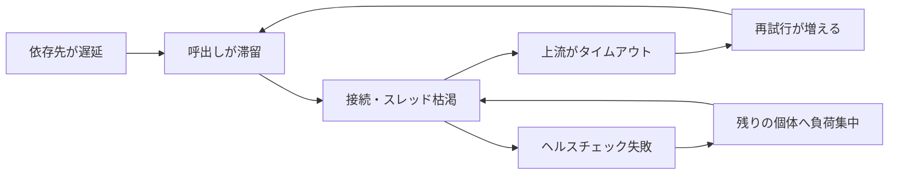

# 高負荷時の振る舞いと障害モード（Scale Behavior & Failure Modes）

## 1. 一言でいうと

**高負荷時の障害モードとは、到着する仕事が処理能力へ近づいた結果、待ちと資源消費が互いを増幅して正常時とは異なる振る舞いになることです。**

容量を少し超えただけでも、未処理の仕事は蓄積します。遅くなった利用者や上流が再試行すると新しい仕事が増え、さらに遅くなります。この正のフィードバックを切ることが重要です。

## 2. なぜ必要なのか

平均負荷が低いことは安全を意味しません。セール開始、バッチの同時実行、一つの人気商品、依存先の遅延によって局所的な限界へ達します。障害時には次が同時に起こり得ます。

- キューが伸び、処理開始までの時間が増える
- DBロックや接続待ちが増え、1件の処理時間も伸びる
- タイムアウトした上流が再試行し、負荷を追加する
- ヘルスチェック失敗で容量が減り、残りへ負荷が集中する

## 3. 仕組み

### 4.1 到着率と処理率

1秒に120件到着し、ワーカーが100件しか処理できなければ、差の20件が毎秒蓄積します。キューがあることで直ちに失敗しなくても、処理能力を超え続ける限り回復しません。

`滞留件数 ÷ 回復時の余剰処理率` は、概算の解消時間になります。10万件が滞留し、通常流入を処理した後の余剰が毎秒50件なら、解消には約2,000秒かかります。

### 4.2 代表的な限界

| 現象 | 観測するもの | 典型的な原因 |
|---|---|---|
| 競合 | ロック待ち、DB待ち、CPU利用率との差 | 同じ行・共有資源への集中 |
| ホットパーティション | キー別RPS、シャード別遅延 | 偏ったキー、時系列キー |
| キュー滞留 | oldest age、深さ、到着/処理率 | 継続的な容量不足、毒メッセージ |
| メモリ圧迫 | 使用量、GC時間、OOM | 無制限キャッシュ、滞留オブジェクト |
| 接続枯渇 | pool wait、active/idle数 | 遅い依存先、過大なプール |
| 帯域限界 | bytes/s、packet loss、再送 | 大きな応答、fan-out |

### 4.3 連鎖障害



再試行は一時的な失敗には有効ですが、過負荷には追加負荷です。回数上限、バックオフ、ジッター、全体の期限、再試行予算が必要です。

## 4. 具体例：注文確定キューの滞留

前提は通常80件/秒、最大処理能力100件/秒です。セールで5分間150件/秒が到着すると15,000件が余分に溜まります。流入が80件/秒へ戻った後の余剰能力は20件/秒なので、解消には少なくとも750秒かかります。

```text
入力:
  arrival_rate = 150 jobs/s
  service_rate = 100 jobs/s
  burst_duration = 300 s

計算:
  backlog = (150 - 100) × 300 = 15,000 jobs
  drain_time = 15,000 ÷ (100 - 80) = 750 s

期待結果:
  バースト終了後も約12.5分は遅延影響が残る
```

注文は失ってはいけないため、閲覧リクエストとは違い単純な破棄ができません。受け付け上限、在庫予約期限、優先度、ワーカー増強、利用者への処理中表示を組み合わせます。

## 5. いつ使うか・使わないか

この分析は、ピークがあるAPI、非同期処理、共有DB、外部APIへのfan-outで必要です。特に「平均では余裕があるのに時々落ちる」場合に有効です。

小さな開発環境の短いベンチマークだけから本番限界を断定してはいけません。データ量、キャッシュ温度、依存先、長時間実行によるGCや接続リークが異なるためです。

## 6. 設計上の選択肢とトレードオフ

| 対策 | 効果 | 代償 |
|---|---|---|
| 有界キュー | メモリと待ち時間を制限 | 拒否・破棄方針が必要 |
| レート制限 | 過負荷前に入口を守る | 一部利用者を待たせる |
| バックプレッシャー | 上流へ減速を伝える | システム間の契約が必要 |
| バルクヘッド | 重要機能への波及を防ぐ | 資源の融通が減る |
| 負荷遮断 | 回復可能な容量を残す | 品質や機能を縮退する |
| オートスケール | 継続負荷へ容量を追加 | 起動遅延、共有依存先の限界 |

## 7. よくある失敗と運用上の注意

### タイムアウトを長くするだけ

失敗は減って見えても、待機中の接続やメモリが増えます。利用者の期限から逆算し、依存先ごとに予算を配ります。

### 全層で再試行する

3層が各3回試すと、最下流へ最大27回届き得ます。再試行する層を決め、冪等性を確保します。

### キューの件数だけを見る

1件の処理時間が違えば深さだけでは緊急度を判断できません。最古メッセージの年齢、到着率、処理率も監視します。

### 容量を100%使う

障害で1台失ったときや急増時の余裕がありません。N+1故障やピークを含む安全余裕を負荷試験で決めます。

## 8. 第三者へ説明する

### 30秒で説明するなら

> 高負荷時は、処理能力を超えた仕事が待ち行列へ溜まり、待ち時間と資源消費が増えます。タイムアウト後の再試行や個体停止が負荷を追加すると連鎖障害になります。入口制限、有界キュー、バックプレッシャー、資源分離で増幅を止め、到着率と処理率を測ります。

### 3分で説明するなら

1. 到着率が処理率を超えると滞留が増え続けると説明する。
2. EC注文キューの数値例で、バースト終了後も影響が残ることを示す。
3. 競合、ホットキー、GC、接続など処理率を下げる要因を挙げる。
4. 再試行と容量減少が正のフィードバックを作ると説明する。
5. 有界化、負荷遮断、分離、容量試験で安全余裕を決めると結ぶ。

## 9. ケース問題・追加質問

### ケース問題

決済APIが遅くなり、注文APIも全停止しました。最初に何を変えますか。

::: details 模範回答
注文から決済への呼び出しに全体期限と短い接続タイムアウトを設け、決済用の接続・同時実行数を隔離します。無制限な再試行を止め、バックオフとジッター、回数上限を設定します。可能なら注文を「決済処理中」として受け付け、非同期化します。同時にpool wait、依存先遅延、再試行数を計測して容量を確認します。
:::

### よくある追加質問

**Q. キューがあればスパイクを吸収できますか？**

一時的で、後から処理できる量なら吸収できます。平均到着率が処理率を超える限り、遅延を先送りするだけです。

**Q. CPUが低いのに遅いのはなぜですか？**

DBロック、接続、ネットワーク、外部APIを待っている可能性があります。利用率だけでなく待ち時間と飽和を見ます。

**Q. オートスケールで解決できますか？**

独立に処理でき、共有依存先に余裕があり、増設が間に合う場合に有効です。競合点へ接続を増やすと悪化します。

## 10. まとめ

- 容量付近では待ちと資源消費が非線形に悪化する。
- 到着率、処理率、最古ジョブ年齢、待ち時間を測る。
- 再試行や容量減少は連鎖障害を増幅し得る。
- 有界化、負荷遮断、バックプレッシャー、分離で回復余地を守る。
- 本番に近い長時間負荷試験で安全余裕を決める。

## 11. 参考資料

- [AWS Builders' Library: Timeouts, retries, and backoff with jitter](https://aws.amazon.com/builders-library/timeouts-retries-and-backoff-with-jitter/)
- [AWS Builders' Library: Avoiding insurmountable queue backlogs](https://aws.amazon.com/builders-library/avoiding-insurmountable-queue-backlogs/)
- [Google Cloud Architecture Framework: Cascading failures](https://docs.cloud.google.com/architecture/framework/reliability/cascading-failures)
- [Kubernetes: Horizontal Pod Autoscaling](https://kubernetes.io/docs/concepts/workloads/autoscaling/horizontal-pod-autoscale/)
