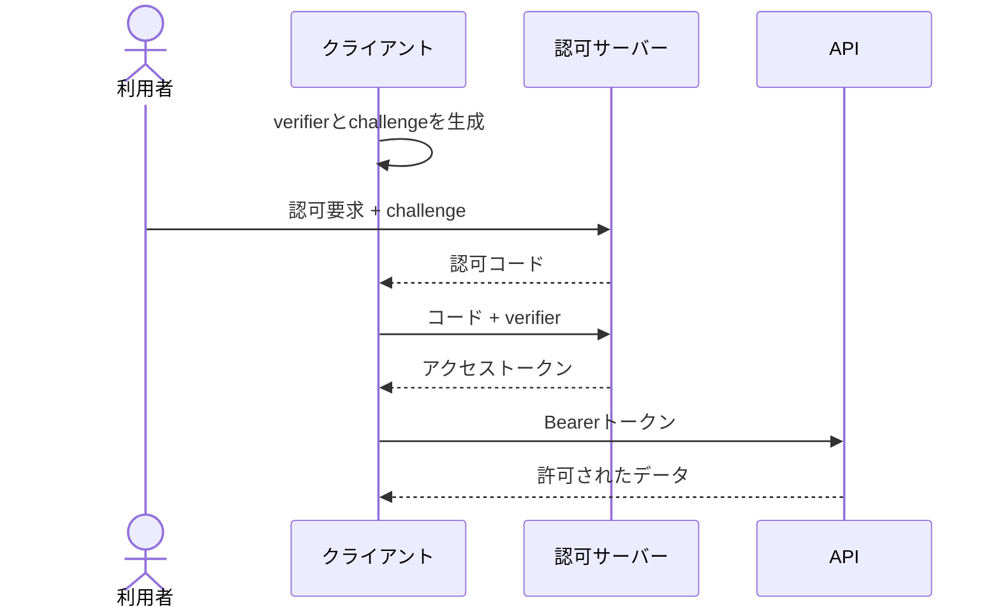

# セキュリティと認証・認可（Security & Authentication）

## 1. 一言でいうと

**セキュリティとは、守る対象と想定する脅威を明確にし、認証・認可・入力処理・暗号化・監視など複数の対策で被害の可能性と大きさを下げる活動です。**

認証は「誰か」を確かめ、認可は「その主体がこの操作をしてよいか」を毎回判断します。ログイン済みであることは、他人の注文を読んでよい根拠にはなりません。

## 2. なぜ必要なのか

ECサイトは氏名、住所、注文、支払いに関する情報を扱います。一つの入力検証漏れや過剰権限が、情報漏えい、不正購入、サービス停止につながります。攻撃だけでなく、設定ミス、秘密情報のログ出力、退職者権限の残存も脅威です。

後付けの防御では、データ所有境界や認可点を直せません。設計時に資産、主体、信頼境界、脅威、検知・復旧方法を決めます。

## 3. 仕組み

### 4.1 認証、認可、委任

- **認証（Authentication）**: パスワード、パスキー、多要素認証などで主体を確認する。
- **認可（Authorization）**: 主体、操作、対象、状況から許可を判断する。
- **OAuth 2.0**: クライアントへAPIアクセス権を委任する枠組み。
- **OIDC**: OAuth 2.0の上に本人情報を扱う認証層を定義する。

OAuthのアクセストークンを「ログイン証明」として無条件に扱いません。OIDCではID Tokenの発行者、対象者、有効期限、nonceなどを検証します。

### 4.2 セッションとトークン

| 方式 | 状態 | 強み | 注意点 |
|---|---|---|---|
| サーバーセッション | サーバー側にセッション状態 | 即時失効や権限変更を反映しやすい | ストアの可用性とCookie保護 |
| 自己完結JWT | 署名済みclaimsをトークンに保持 | サービス間で検証しやすい | 有効期限内の失効、鍵ローテーション、サイズ |

JWTでも、ユーザー無効化や高リスク操作のためサーバー状態を参照する場合があります。「JWTなら完全にステートレス」とは限りません。署名は内容の秘匿でもありません。

### 4.3 OAuth認可コードフローとPKCE



現在のOAuth 2.0 Security BCPでは、公開クライアントはPKCEを使用し、機密クライアントにも推奨されています。リダイレクトURIの厳密な照合、state/nonce、最小scopeなども必要です。

### 4.4 代表的な入力経路の防御

- **SQL Injection**: 値を文字列連結せず、パラメーター化クエリを使う。
- **SSRF**: 取得先を許可リスト化し、DNS解決後のIP、リダイレクト、プロトコル、レスポンス量を制限する。
- **CSRF**: Cookie認証の更新操作でCSRFトークン、SameSite、Origin確認を組み合わせる。
- **XSS**: 出力文脈に応じてエスケープし、危険なHTMLをサニタイズする。

## 4. 具体例：注文詳細APIの認可

```sql
-- 前提: :current_user_id は認証基盤が確定した主体ID
-- 入力: order_id = 'o-123', current_user_id = 'u-9'
-- 期待結果: 所有者の注文だけ返し、他人の注文は返さない
SELECT id, status, total_amount
FROM orders
WHERE id = :order_id
  AND customer_id = :current_user_id;
```

入力値をパラメーター化するだけでなく、問い合わせ自体に所有者条件を入れます。管理者の場合は別の明示的な権限を評価し、成功・拒否を監査ログへ残します。URLのIDを変えただけで他人の注文を読める状態は、認証済みでも認可不備です。

## 5. いつ使うか・使わないか

サーバーセッションはWebアプリの即時失効や単純なログイン管理に向きます。短命なアクセストークンは複数APIや委任に向きます。RBACは役割が安定した組織、ABACは所有者、部署、時刻など動的条件が重要な場合に向きます。

独自暗号、独自トークン形式、独自OAuthフローを作りません。実績あるライブラリと管理サービスを使い、設定と鍵管理をレビューします。公開情報だけの小規模機能へ複雑な認可基盤を導入する場合も、運用負担を評価します。

## 6. 設計上の選択肢とトレードオフ

| 判断 | 一方の利点 | 代償 |
|---|---|---|
| セッション | 即時失効、単純なWebログイン | 共有状態 |
| 短命JWT | 分散検証、依存削減 | 失効と鍵配布 |
| RBAC | 理解・監査しやすい | 役割爆発 |
| ABAC | 細かな条件 | ポリシー評価と説明が複雑 |
| 許可リスト | 攻撃面を狭くする | 新規宛先追加の運用 |
| 強い暗号化 | 漏えい時の被害低減 | 鍵の保護・ローテーション |

## 7. よくある失敗と運用上の注意

### 認証だけでアクセスを許す

すべての読み書きで対象リソースへの認可を確認します。IDを推測できないことは認可ではありません。

### JWTのアルゴリズムやclaimsを十分に検証しない

許可アルゴリズムを固定し、署名、issuer、audience、有効期限を検証します。鍵の取得元も信頼境界です。

### シークレットをコードやログへ置く

専用ストアで保存し、短命資格情報とローテーションを使います。ログ、例外、トレースからトークンや個人情報を除きます。

### URL検証を文字列だけで行う

SSRF対策ではDNS再解決やリダイレクト後に内部IPへ到達する可能性があります。ネットワーク側の送信制限も併用します。

## 8. 第三者へ説明する

### 30秒で説明するなら

> セキュリティは、守る資産と脅威を決め、複数の防御で侵害の可能性と被害を下げる活動です。認証で誰かを確認し、認可でその操作を許すかを毎回判断します。標準の認証・委任方式、最小権限、パラメーター化、秘密管理、監査を組み合わせます。

### 3分で説明するなら

1. 資産、主体、信頼境界、脅威から始めると説明する。
2. 注文APIを例に、認証済みでも所有者認可が必要だと示す。
3. セッションとJWT、OAuthとOIDCの役割を区別する。
4. SQLi、SSRF、CSRF、XSSは入力経路ごとに防御が違うと説明する。
5. 最小権限、鍵更新、監査、インシデント対応まで継続すると結ぶ。

## 9. ケース問題・追加質問

### ケース問題

ログイン利用者がURLの注文IDを変えると、他人の注文を閲覧できました。原因と対策は何ですか。

::: details 模範回答
認証はされていますが、注文と現在の主体の関係を確認するオブジェクト単位の認可が欠けています。DB問い合わせまたはサービス層で所有者条件を必須にし、管理者権限は別に明示します。すべての取得・更新・削除をテストし、拒否イベントを監査します。ランダムなIDへの変更だけでは根本対策になりません。
:::

### よくある追加質問

**Q. JWTは暗号化されていますか？**

一般的な署名付きJWTは改ざんを検知できますが、payloadを秘匿しません。機密情報を安易に入れません。

**Q. OAuth 2.0は認証方式ですか？**

主目的はアクセス権の委任です。ログインにはOAuth 2.0上のOIDCを使います。

**Q. HTTPSなら入力検証は不要ですか？**

HTTPSは通信路を保護しますが、正規の利用者からの悪意ある入力や認可不備は防ぎません。

## 10. まとめ

- 認証と認可を分け、各リソース操作で認可する。
- セッションとJWTは失効、配布、運用要件から選ぶ。
- OAuth 2.0は委任、OIDCは認証層である。
- 脆弱性ごとに入力経路と信頼境界へ多層防御を置く。
- 最小権限、秘密管理、監査、更新を継続する。

## 11. 参考資料

- [RFC 9700: Best Current Practice for OAuth 2.0 Security](https://www.rfc-editor.org/rfc/rfc9700.html)
- [OpenID Connect Core 1.0](https://openid.net/specs/openid-connect-core-1_0.html)
- [OWASP Authentication Cheat Sheet](https://cheatsheetseries.owasp.org/cheatsheets/Authentication_Cheat_Sheet.html)
- [OWASP Authorization Cheat Sheet](https://cheatsheetseries.owasp.org/cheatsheets/Authorization_Cheat_Sheet.html)
- [OWASP SQL Injection Prevention Cheat Sheet](https://cheatsheetseries.owasp.org/cheatsheets/SQL_Injection_Prevention_Cheat_Sheet.html)
- [OWASP SSRF Prevention Cheat Sheet](https://cheatsheetseries.owasp.org/cheatsheets/Server_Side_Request_Forgery_Prevention_Cheat_Sheet.html)
