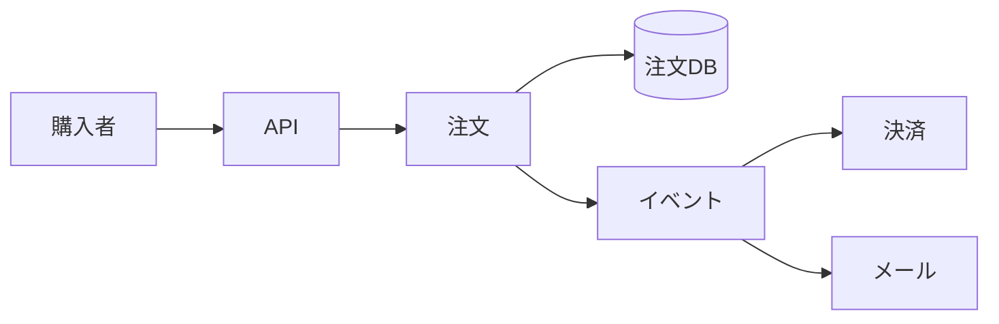

# システム設計（System Design）

## 1. 一言でいうと

**システム設計とは、要求を満たす構成を一発で当てることではなく、要件と制約を明らかにし、負荷・データ・障害を見積もって、検証可能な判断を積み上げることです。**

設計図を先に描くのではなく、「誰が何をするのか」「どれほど使われるのか」「何を失ってはいけないか」から始めます。同じECサイトでも、1日100件の注文と毎秒1万件の注文では適切な構成が異なります。

## 2. なぜ必要なのか

要件を曖昧にしたまま技術を選ぶと、過剰設計か能力不足になります。たとえば「高可用にする」だけでは、許される停止時間も、失ってよい注文数も分かりません。

設計では最低限、次を確認します。

- **機能要件**: 商品検索、カート投入、注文確定など
- **品質要件**: レイテンシ、可用性、整合性、耐久性、セキュリティ
- **規模**: 利用者数、リクエスト数、データ量、増加率、ピーク倍率
- **制約**: 期限、予算、チーム、既存技術、法令
- **失敗時の期待**: 停止、縮退、再試行、復旧時間、データ損失許容

## 3. 仕組み：設計を進める順序


### 4.1 負荷を概算する

精密な予測ではなく、桁を把握するための概算です。

```text
1日 1,000,000 リクエスト
平均RPS = 1,000,000 / 86,400 ≒ 12
ピークが平均の10倍なら 約120 RPS

1注文 2 KB、1日100,000注文
年間の生データ = 2 KB × 100,000 × 365 ≒ 73 GB
```

実際にはインデックス、レプリカ、ログ、バックアップの分が加わります。平均だけでなくピーク、読み書き比率、保持期間、偏りを置きます。仮定は数値と一緒に記録します。

### 4.2 APIとデータ所有を決める

主要な操作をAPIとして表し、どのデータを誰が更新するか決めます。注文確定では、価格、在庫、決済のどこまでを同一トランザクションにできるかが重要です。

```http
POST /orders
Idempotency-Key: 01J...

{"items":[{"productId":"P1","quantity":2}]}
```

期待結果は、成功時に注文IDと状態が返り、同じ冪等キーの再送で注文が重複しないことです。HTTP形式だけでなく、重複、タイムアウト、部分失敗時の意味まで契約に含めます。

### 4.3 重要な経路から構成する



注文受付に不可欠な処理と、後で完了してよい処理を分けます。メール送信を非同期にすれば応答は速くなりますが、配送保証、重複処理、遅延監視が必要になります。

## 4. 具体例：セールに耐える注文API

前提は通常120 RPS、セール時1,200 RPS、注文は失えず、商品画像は一時的に遅くてもよいとします。

1. CDNで静的コンテンツを配信し、アプリへの負荷を減らす。
2. ステートレスなAPIを複数配置し、測定した処理能力に余裕を加える。
3. 注文DBを正本とし、書き込み整合性を優先する。
4. メールや分析はキューへ送り、注文応答から外す。
5. 決済遅延時は注文を `payment_pending` として保持し、安全に再処理する。
6. 負荷試験で1,200 RPSと依存先遅延を再現し、SLOを満たすか確かめる。

ここでキャッシュやキューは「定番だから」ではなく、特定の読み取り負荷や応答時間を満たすために導入します。

## 5. いつ詳細化し、いつ止めるか

### 詳細化する

- データ損失や二重決済など、事業上の損害が大きい経路
- SLOを外す可能性が高いボトルネック
- 外部API、単一DB、特定リージョンなどの単一障害点
- 後から変更しにくいデータ所有境界や公開契約

### 詳細化を止める

- 要件から必要性を説明できない将来予測
- 実測前の細かなインスタンス台数
- 交換可能な実装ライブラリの選定
- 今回のスコープ外と明示した機能

## 6. 設計判断のトレードオフ

| 選択 | 得られるもの | 失うもの・追加責任 |
|---|---|---|
| キャッシュ | 読み取り遅延とDB負荷の低下 | 無効化、古い値、追加障害点 |
| 非同期処理 | 応答経路の短縮、負荷平準化 | 結果整合性、重複、追跡の難しさ |
| レプリカ | 読み取り能力、可用性 | 複製遅延、コスト |
| シャーディング | 書き込み・容量の水平分割 | 横断問い合わせ、再配置の複雑さ |
| 複数リージョン | 地域障害への耐性 | 整合性、運用、費用の増加 |

設計案には「採用理由」「捨てた案」「前提」「失敗条件」「検証方法」を併記します。

## 7. よくある失敗と運用上の注意

- **数字がない**: 「大量」「高速」では検証できない。単位付きの目標にする。
- **平均だけを見る**: ピークと偏りを無視すると、セール時に崩れる。
- **正常系だけ描く**: タイムアウト、再試行、重複、縮退を主要フローに加える。
- **単一障害点を列挙して終わる**: 検出、切替、復旧の担当と時間を決める。
- **複雑さを無料とみなす**: 新しいサービスごとに監視、権限、デプロイ、当番が増える。
- **容量計画を一度で終える**: 実測値、成長率、リードタイムから定期的に更新する。

## 8. 第三者へ説明する

### 30秒で説明するなら

> システム設計は、機能と品質要件を確認し、負荷とデータ量を概算して、API・データ・処理フロー・障害対策を根拠付きで組み立てる作業です。唯一の正解を当てるのではなく、選択肢の代償と仮定を示し、負荷試験や運用指標で検証できる形にします。

### 3分で説明するなら

1. 利用者、主要機能、SLO、データ損失許容、制約を確認する。
2. 平均・ピークRPS、データ量、読み書き比率を概算する。
3. APIとデータ所有を決め、重要な読み書き経路を描く。
4. ボトルネック、単一障害点、部分失敗を洗い出す。
5. キャッシュやキューなどの選択を、得るものと追加責任で比較する。
6. 仮定を負荷試験と本番指標で検証し、設計を更新する。

## 9. ケース問題・追加質問

### ケース問題

商品検索が遅いため、すべてをマイクロサービス化する案が出ました。最初に何を確認しますか。

::: details 模範回答
まず検索のSLO、遅い割合、ピーク負荷、クエリとDB実行計画、キャッシュヒット率を確認します。原因が検索クエリやインデックスなら、サービス分割では解決しません。独立スケールや所有権の分離が必要だと実測できた場合だけ、検索機能の分離を候補にします。変更前後を比較できる負荷試験も決めます。
:::

**Q. 見積もりが外れたら設計は失敗ですか？**

概算の目的は桁と支配的な制約を見つけることです。仮定と安全余裕を明示し、実測で更新できれば役割を果たしています。

**Q. 高可用なら複数リージョンが必要ですか？**

必ずしも必要ではありません。目標SLO、想定障害、RTO/RPO、切替試験、費用を比較し、単一リージョンの複数ゾーンで足りるか先に評価します。

## 10. まとめ

- 要件と制約を数値で定めてから構成を選ぶ。
- 平均だけでなくピーク、偏り、増加率を概算する。
- API、データ所有、主要フロー、失敗経路を順に設計する。
- すべての追加コンポーネントには運用上の代償がある。
- 仮定を記録し、試験と本番データで設計を更新する。

## 11. 参考資料

- [AWS Well-Architected Framework](https://docs.aws.amazon.com/wellarchitected/latest/framework/welcome.html)
- [Microsoft Azure Architecture Center: Architecture styles](https://learn.microsoft.com/en-us/azure/architecture/guide/architecture-styles/)
- [Google SRE Book: The Production Environment at Google](https://sre.google/sre-book/production-environment/)
- [Google SRE Book: Testing for Reliability](https://sre.google/sre-book/testing-reliability/)
