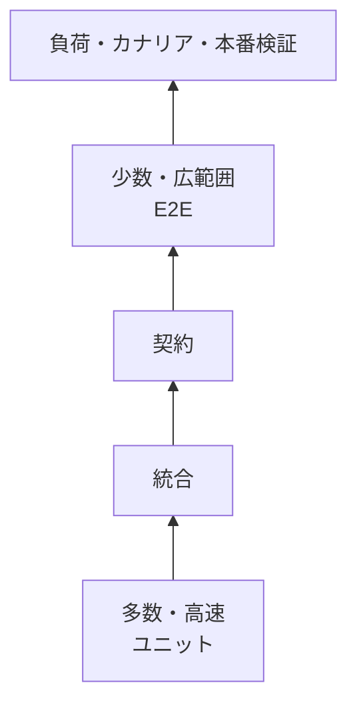

# テストと品質保証（Testing & Quality Assurance）

## 1. 一言でいうと

**テストとは、特定の入力や障害に対する期待を実行可能な形で記録し、変更後もその期待が満たされるか確かめる仕組みです。**

テストに合格しても完全な正しさは証明できません。しかし、重要な性質を異なる境界で確認すれば、変更による不確実性を小さくできます。

## 2. なぜ必要なのか

ECサイトの注文処理は、関数単体では正しくても、DB制約、メッセージ配送、決済API、実際の設定を組み合わせたときに失敗します。一方、すべてをブラウザから試すE2Eテストだけでは遅く、原因も特定しにくくなります。

そこで、失敗したときに知りたいことへ最も近い境界を選びます。

- 業務ルールが正しいか
- 自分たちのコードとDBが正しく連携するか
- サービス間の契約が互換か
- 利用者の主要動線が成立するか
- 目標負荷と障害時の挙動を満たすか

## 3. 仕組み：テストの層



| 種類 | 主に確かめること | 代表的な依存 |
|---|---|---|
| ユニット | 一つのルールや変換 | メモリ内の対象コード |
| 統合 | DB、キュー、HTTPクライアントとの接続 | 実DBや実プロトコル |
| 契約 | 提供者と利用者のメッセージ互換性 | スキーマや記録済み契約 |
| E2E | 主要な利用者動線 | 配置済みシステム全体 |
| 負荷・ストレス | SLOと限界、劣化の仕方 | 本番相当の構成 |
| 本番検証 | 実設定、実トラフィックでの振る舞い | カナリア、合成監視 |

テスト数を固定比率にするのではなく、変更頻度、障害時の損害、実物でしか見つからない問題から配分します。

### 4.1 Arrange・Act・Assert

```ts
// 前提: 在庫が1個の商品P1がある
const inventory = new Inventory({ P1: 1 })

// 入力: 2個を確保する
const result = inventory.reserve('P1', 2)

// 期待結果: 失敗し、在庫数は変わらない
expect(result).toEqual({ ok: false, reason: 'insufficient_stock' })
expect(inventory.quantity('P1')).toBe(1)
```

失敗時に「何を準備し、何を行い、何が違ったか」が分かるテストにします。実装の内部呼び出し回数ではなく、利用者から見える振る舞いを優先します。

## 4. 具体例：注文確定をどう分けて試すか

1. **ユニット**: 合計金額、割引条件、状態遷移を表形式で検証する。
2. **DB統合**: 同じ冪等キーを2回挿入して一意制約が重複注文を防ぐか確認する。
3. **HTTP統合**: 決済の成功、タイムアウト、5xx、不正レスポンスをスタブサーバーで再現する。
4. **契約**: 注文イベントの必須項目や後方互換性を確認する。
5. **E2E**: 「カート → 注文 → 完了表示」という最重要動線を少数だけ通す。
6. **負荷**: ピークRPSでp95レイテンシとエラー率を測り、限界を超えたときの劣化も観察する。

並行実行による在庫競合や、処理途中でのプロセス停止も重要です。テストごとに「どのリスクを減らすか」を一文で言えるようにします。

## 5. いつ何を使うか

### モックが向く

- 時刻、乱数、外部障害などを決定的に制御したい
- 外部サービスが高価、遅い、危険である
- 自分のロジックの分岐を高速に確認したい

### 実物が向く

- SQL、トランザクション、文字コード、接続設定を検証する
- SDKやプロトコルの実際の挙動が重要
- モックと本物の乖離が大きなリスクになる

### E2Eが向く

- 売上やログインに直結する少数の経路
- 配線、設定、認証、画面をまとめて確かめる必要がある

## 6. 設計上の選択肢とトレードオフ

| 選択 | 強み | 弱み |
|---|---|---|
| 細かなユニットテスト | 高速で原因を絞りやすい | 統合ミスを見逃す |
| 実DBを使う統合テスト | SQLと制約を現実的に検証 | 起動・初期化が遅い |
| 契約テスト | サービスを同時起動せず互換性確認 | 意味上の不一致は別途確認が必要 |
| E2E | 利用者視点の信頼が高い | 遅く不安定で原因が広い |
| 本番カナリア | 実環境との差が小さい | 利用者影響を抑える仕組みが必要 |

## 7. よくある失敗と運用上の注意

- **実装詳細を固定する**: リファクタリングで壊れる。公開された振る舞いを検証する。
- **正常系だけ**: 空、最大値、重複、並行、タイムアウト、部分失敗を加える。
- **待ち時間で同期する**: `sleep` より状態やイベントを待つ。
- **不安定なテストを放置する**: 再実行で隠さず、隔離して原因と所有者を追う。
- **テストデータを共有する**: テストごとに生成し、順序依存をなくす。
- **カバレッジ率を目的にする**: 重要経路の性質と失敗モードを優先する。
- **本番設定を試さない**: 構成検証、段階リリース、合成監視で差を埋める。

## 8. 第三者へ説明する

### 30秒で説明するなら

> テストは、入力や障害に対する期待を実行可能な仕様として残し、変更後の不確実性を減らす仕組みです。業務ルールは高速なユニットテスト、DBや通信は統合テスト、主要動線は少数のE2E、性能と実設定は負荷試験やカナリアで確認します。数ではなく、守りたいリスクに合う境界を選びます。

### 3分で説明するなら

1. 変更で壊れたときの損害と発見したい失敗を挙げる。
2. 最小の境界で業務ルールをユニットテストする。
3. DBや外部APIとの接点は実物に近い統合テストを置く。
4. サービス間は契約、利用者の主要経路は少数のE2Eで守る。
5. 負荷、障害、設定差はストレステストや段階リリースで確認する。
6. 失敗の診断時間とテストの安定性も品質として管理する。

## 9. ケース問題・追加質問

### ケース問題

決済APIを完全にモックしたテストは通りますが、本番だけタイムアウトします。次に何を追加しますか。

::: details 模範回答
実HTTPサーバーを使う統合テストで、接続、応答遅延、タイムアウト、再試行、レスポンス形式を検証します。さらに本番相当のタイムアウト設定を構成テストで確認し、段階リリースでエラー率とレイテンシを監視します。外部サービスそのものを常時テストできない場合も、プロトコル境界と設定差は自分たちで検証できます。
:::

**Q. 100%カバレッジなら安全ですか？**

いいえ。実行された行の割合は、期待の妥当性、競合、設定、外部依存、性能を保証しません。

**Q. テストできないコードはどうしますか？**

時刻やI/Oを境界へ押し出し、業務判断を副作用から分離します。テストしにくさは責務や依存が混ざっている兆候です。

## 10. まとめ

- テストは変更による不確実性を減らす実行可能な期待である。
- リスクに最も近い、できるだけ小さな境界で確認する。
- モックだけでなく、DBやプロトコルの実物を適切に使う。
- E2Eは重要動線へ絞り、負荷と本番差は別の検証で補う。
- 不安定さ、診断時間、テストデータも継続的に管理する。

## 11. 参考資料

- [Google SRE Book: Testing for Reliability](https://sre.google/sre-book/testing-reliability/)
- [Google SRE Book: Release Engineering](https://sre.google/sre-book/release-engineering/)
- [Martin Fowler: The Practical Test Pyramid](https://martinfowler.com/articles/practical-test-pyramid.html)
- [Kubernetes Documentation: Liveness, Readiness, and Startup Probes](https://kubernetes.io/docs/concepts/configuration/liveness-readiness-startup-probes/)
