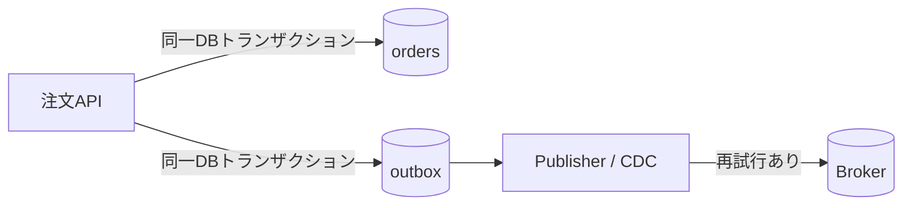
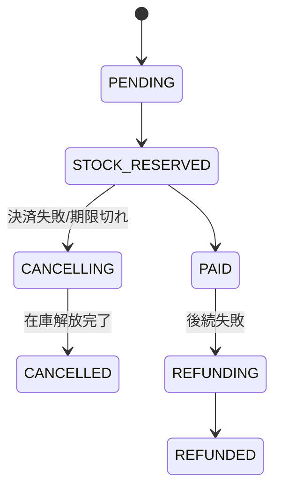

# トランザクションと障害（Transactions & Failures）

## 1. 一言でいうと

**トランザクションとは、複数の操作にまたがる不変条件を、同時実行や障害があっても守るための境界です。**

単一DBなら複数更新をまとめてコミットできます。複数サービスや外部決済をまたぐと、同じ境界を簡単には広げられません。その場合は途中状態を明示し、再試行、補償、照合で業務として整合させます。

## 2. なぜ必要なのか

注文作成、在庫減算、決済要求の途中でプロセスが停止すると、「支払ったのに注文がない」「在庫だけ減った」といった状態になり得ます。さらに同時注文が同じ在庫を読み、売り越すこともあります。

障害を例外処理だけで扱うのではなく、守る不変条件、原子的に更新できる範囲、途中状態、再開方法を設計します。何でも分散トランザクションにすると調整範囲が広がり、可用性と運用が悪化します。

## 3. 仕組み

### 4.1 ACIDと分離レベル

- **Atomicity（原子性）**: 境界内の変更をすべて反映するか、すべて反映しない
- **Consistency（一貫性）**: 定義した制約を満たす状態から別の正しい状態へ移す
- **Isolation（分離性）**: 同時トランザクションの途中状態がどう見えるかを制御する
- **Durability（永続性）**: コミット済み結果を規定の障害に対して保持する

ACIDの一貫性はアプリの業務ルールをDBが自動理解する意味ではありません。制約、ロック、条件付き更新を設計します。分離レベルの名称と詳細はDBごとに異なるため、対象製品を確認します。高い分離性ほど再試行や競合待ちが増える場合があります。

### 4.2 二重書き込みとOutbox



DB更新後に直接イベント送信すると、その間のクラッシュでイベントを失います。Outboxでは業務更新とイベント予定を同じDBトランザクションへ入れます。発行側の再試行で重複し得るため、受信側の冪等性は依然必要です。

### 4.3 2相コミットとSaga

2相コミット（2PC）は、調整役が参加者へ準備を求め、全員が準備できたらコミットを決定します。対応製品間で原子的な決定を作れますが、障害時の待機、ロック、調整役の復旧、運用上の結合が増えます。「常に使えない」のではなく、必要な保証と参加者の対応状況で選びます。

Sagaは複数のローカルトランザクションを進め、失敗時に補償操作を行う長時間ワークフローです。補償は時間を巻き戻すDBロールバックではありません。返金や在庫解放など、新しい業務操作です。

## 4. 具体例：注文・在庫・決済



注文とOutboxの最小例です。

```sql
-- 前提: request_id と event_id に一意制約がある。
BEGIN;
INSERT INTO orders (id, request_id, status)
VALUES (42, 'req-801', 'PENDING');

INSERT INTO outbox (event_id, event_type, aggregate_id, payload)
VALUES ('evt-901', 'OrderCreated', '42', '{"orderId":42}');
COMMIT;
-- 期待結果: 注文と発行予定は両方残るか、両方残らない。
```

Publisherは未発行行を送り、成功後に印を付けます。送信成功後・印更新前に停止すれば再送されるため、`event_id`を変えません。決済タイムアウト時は、同じ冪等キーで状態照会・再試行し、成功か不明のまま新規課金しません。

## 5. いつ使うか・使わないか

### ローカルトランザクションを優先する場合

- 同じDB内で不変条件を守れる
- 即時に一貫した結果が必要
- サービス分割に明確な価値がない

### SagaやOutboxを検討する場合

- 複数の独立したサービス・保存先をまたぐ
- 途中状態と結果整合性を業務が受け入れられる
- 各操作に冪等性、状態照会、補償を定義できる

不可逆な処理を簡単に補償できると思ってはいけません。発送済み商品の回収や送信済みメールは完全には取り消せないため、実行順を工夫し、人手対応を含めます。

## 6. 設計上の選択肢とトレードオフ

| 方式 | 強み | 代償 |
|---|---|---|
| 単一DBトランザクション | 分かりやすい原子性と分離性 | 一つのDB境界に限定 |
| 2PC | 対応参加者間で原子的決定 | 待機、ロック、可用性、運用結合 |
| Sagaオーケストレーション | 状態と補償を集中管理 | 調整役が複雑になる |
| Sagaコレオグラフィ | 発行者と購読者を疎結合にしやすい | 全体の流れと循環依存を追いにくい |
| Transactional Outbox | DB更新と発行予定の欠落を防ぐ | 発行遅延、重複、テーブル清掃 |

ワークフローが長く分岐が多い場合は、状態を明示するオーケストレーションが理解しやすいことがあります。

## 7. よくある失敗と運用上の注意

### タイムアウトを失敗確定とみなす

決済先で完了後に応答だけ失われた可能性があります。冪等キーと照会APIを使い、`UNKNOWN`や`PENDING`を状態として保持します。

### 補償は絶対成功すると仮定する

補償もネットワーク障害や業務制約で失敗します。冪等にし、再試行、DLQ、期限、エスカレーション、人手手順を持たせます。「無期限再試行」だけでは解決しません。

### 分離レベルを確認しない

読み取り後の更新には更新消失や書き込みスキューが起こり得ます。`UPDATE ... WHERE version = ?`、行ロック、一意制約、Serializableと再試行などを不変条件に応じて使います。

### 照合を用意しない

一定時間`PENDING`の注文、注文と決済の金額差、未発行Outbox、補償失敗を定期照合します。件数、滞留時間、再試行数、手動対応数を監視します。

## 8. 第三者へ説明する

### 30秒で説明するなら

> トランザクションは複数操作の不変条件を同時実行や障害から守る境界です。単一DBではACIDを使えますが、サービスや外部決済をまたぐと部分障害が起きます。そこでOutboxでイベント欠落を防ぎ、Sagaで途中状態と補償を管理し、冪等性と照合で最終的な整合性を保ちます。

### 3分で説明するなら

1. 守りたい業務不変条件を先に定義する。
2. ACIDと分離レベルの役割を説明する。
3. DB更新とイベント送信の二重書き込み問題を示す。
4. Outbox、2PC、Sagaの保証と代償を比較する。
5. 決済の不明状態、補償失敗、照合まで正常系として設計すると結ぶ。

## 9. ケース問題・追加質問

### ケース問題

決済APIがタイムアウトしました。注文を失敗にして別の決済要求を送ってよいでしょうか。

::: details 模範回答
すぐ別要求を送るのは危険です。相手側で最初の決済が成功している可能性があります。注文を`PAYMENT_UNKNOWN`などへ置き、同じ冪等キーで再試行するか状態照会APIで確認します。一定時間で解決しない場合の自動・手動照合と顧客表示も決めます。
:::

### よくある追加質問

**Q. SagaならACIDと同じですか？**

いいえ。途中状態が外部から見えることがあり、補償も完全な巻き戻しではありません。業務がその状態を許容する必要があります。

**Q. Outboxなら重複しませんか？**

発行予定の欠落は防げますが、送信後・印更新前の停止で再送され得ます。受信側の重複排除が必要です。

## 10. まとめ

- トランザクション境界は守る不変条件から決める。
- 分離レベルとDB固有の保証を確認する。
- 分散処理では途中状態と不明状態を明示する。
- Outbox、2PC、Sagaは保証と代償が異なる。
- 冪等性、補償、照合、人手対応まで設計する。

## 11. 参考資料

- [PostgreSQL Documentation: Transactions](https://www.postgresql.org/docs/current/tutorial-transactions.html)
- [PostgreSQL Documentation: Transaction Isolation](https://www.postgresql.org/docs/current/transaction-iso.html)
- [Microservices.io: Transactional Outbox](https://microservices.io/patterns/data/transactional-outbox.html)
- [AWS Prescriptive Guidance: Transactional outbox pattern](https://docs.aws.amazon.com/prescriptive-guidance/latest/cloud-design-patterns/transactional-outbox.html)
- [Azure Architecture Center: Saga distributed transactions pattern](https://learn.microsoft.com/en-us/azure/architecture/reference-architectures/saga/saga)
